# Udacity Self-Driving Car Project 5

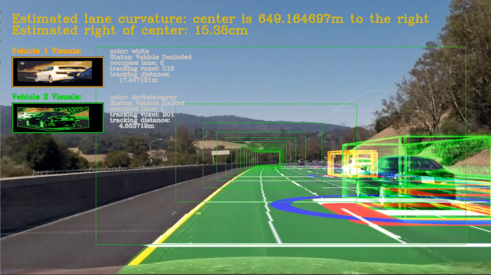

## Vehicle Detection and Tracking

**Objective:** Use Histogram of Oriented Gradients (HOG) feature extraction on a set of labeled vehicle and non-vehicle images to train a classifier to detect vehicles in a video.

**Special Thanks:** Goes to *Ryan Keenan* for spending time to review my work and hear why I am going in a different direction.  Thanks *Ryan*!

**NOTE:**  Please be aware that this report, as with project 4, is a snapshot in time and also a journal of my wondering into discovery.  A lot of what is written here is about my experiments and logs of what worked and what did not, and my detective reasoning as to why.  Notes about what to try next and what we are leaving for future work, so read on dear friend!

## 1 Software Architecture
This Python command line interface (CLI) software, based on project 4 CLI, is also structured internally as a software pipeline, a series of software components, connected together in a sequence or multiple sequences (stages), where the output of one component is the input of the next one.  Our new pipeline implementation is made up of 11 major components, four additional components from project 4, and we will go into them in detail in section 1.2.  We will not go into details about project 4 here, but if you want to know more you can visit its github repository: [https://github.com/diyjac/SDC-P4](https://github.com/diyjac/SDC-P4).  The majority of the P5 software is based on the Open Source Computer Vision Library (OpenCV).  OpenCV is an open source computer vision and machine learning software library. OpenCV was built to provide a common infrastructure for computer vision applications and to accelerate the use of machine perception in the commercial products.  More about OpenCV can be found at [http://opencv.org/](http://opencv.org/).

#### 1.1 Design Goals
The software must meet the following design goals to be successful:

1. Perform a Histogram of Oriented Gradients (HOG) feature extraction on a labeled training set of images and train a Linear SVM classifier
2. Optionally, you can also apply a color transform and append binned color features, as well as histograms of color, to your HOG feature vector.
3. For those first two steps, normalize your features and randomize a selection for training and testing.
4. Implement a sliding-window technique and use your trained classifier to search for vehicles in images.
5. Run your pipeline on a video stream and create a heat map of recurring detections frame by frame to reject outliers and follow detected vehicles.
6. Estimate a bounding box, circle, cube, etc. for vehicles detected.

In addition, we would also like to implement a software pipeline that will:

1. Reduce the complexity of sliding-window technique to reduce processing
2. Allow us to estimate distance from the detected vehicle
3. Optimize on speed of execution:  When not in diagnostics mode, try to spend less time processing each frame.  Where possible, pass the last frames information instead of recomputing it.  Memory is less expensive than CPU time for real-time applications.
4. Use augmented reality techniques to render cool special effects, such as heads-up display of additional information.
5. Use AI algorithms to reduce search space.

#### 1.2 Components and Modulization

To achieve the design goals, we will create a pipeline made of 12 components.  Each of these are described here briefly.

1. **CameraCal:** Python class that handles camera calibrations operations
2. **ImageFilters:** Python class that handles image analysis and filtering operations
3. **ProjectionManager:** Python class that handles projection calculations, operations and augmentation special effects.
4. **Line:** Python class that handles line detection, measurements and confidence calculations and operations.  There is now a shared array of instances of this class: lines.
5. **Lane:** Python class that manages two lines in the array that forms a lane, keeps measurements and confidence calculations and operations at the lane level.  This class is also the starting point for the efficient vehicle detection and tracking classes (vehicles should only be on the road...)  There is a shared array of lanes instances - we are tracking multiple lanes!
6. **Road Grid:** Python class that handles uniform grid placement for our sliding windows implementation and provides **Voxel Occlusion** testing as part of our AI technique, constraints propagation, to reduce the search space.
7. **VehicleDetection:** Python class that handles vehicle detection.  It has two modes
     * Full Scan: This is during initialization when all of the lanes and all positions, 224 in a four-lane highway, are used in the sliding window before **Voxel Occlusion** constraint propagation technique is applied.
     * Sentinel Scan:  This is for video after full scan is complete.  Only entry points in the lane lines are now scanned; and thus, drastically reduce number of sliding window searchs per frame from 224 to just ***9*** for a four lane highway even before applying **Voxel Occlusion** constraint propagation.
8. **Vehicles:** Python class that handles vehicle identification once detected.  There is a shared array of vehicles order by depth.  Nearest first to help with vehicle occlusion calculations.
9. **VehicleTracking:** Python class that tracks vehicle once identified.  It keeps a life cycle of vehicles tracked including occlusion when one vehicle goes in front of another.  Handles vehicle contour calculations and masking.
10. **RoadManager:** Python class that handles image, projection and lanes, lines and vehicle propagation pipeline decisions.
11. **DiagManager:** Python class that handles diagnostic output requests
12. **P5pipeline.py:** Main Python CLI component that handles input/output filename checking, option selections and media IO.

This is a block diagram of how the classes are organized to process an image or a video (sequence of images):

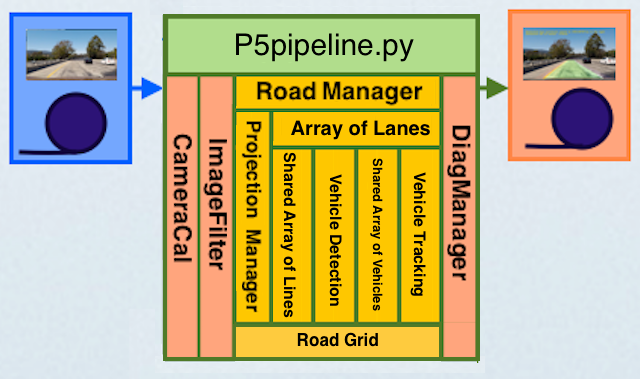

*NOTE: We will try to be brief in the later sections of this report as requested.  If a more detailed discussion is desired, please let us know.*

### 1.3 Coding Style

We have started phase 1 of modifying our code to comply with Python coding standard as specified by [http://docs.python-guide.org/en/latest/writing/style/](http://docs.python-guide.org/en/latest/writing/style/) which is adopted from the [PEP8 Standard](https://www.python.org/dev/peps/pep-0008/).  As such, we subscribe to the **Zen of Python**:

```
(tensorflow) jchen@jchen-G11CD:~/SDCND/SDC-P5/collected/20170124211616$ python
Python 3.5.2 |Anaconda custom (64-bit)| (default, Jul  2 2016, 17:53:06) 
[GCC 4.4.7 20120313 (Red Hat 4.4.7-1)] on linux
Type "help", "copyright", "credits" or "license" for more information.
>>> import this
The Zen of Python, by Tim Peters

Beautiful is better than ugly.
Explicit is better than implicit.
Simple is better than complex.
Complex is better than complicated.
Flat is better than nested.
Sparse is better than dense.
Readability counts.
Special cases aren't special enough to break the rules.
Although practicality beats purity.
Errors should never pass silently.
Unless explicitly silenced.
In the face of ambiguity, refuse the temptation to guess.
There should be one-- and preferably only one --obvious way to do it.
Although that way may not be obvious at first unless you're Dutch.
Now is better than never.
Although never is often better than *right* now.
If the implementation is hard to explain, it's a bad idea.
If the implementation is easy to explain, it may be a good idea.
Namespaces are one honking great idea -- let's do more of those!
>>> 
```

### 1.4 Pipeline Operations

As explained earlier, this pipeline is command line based.  You may use the help option to get more information on how to operate it.

```
(tensorflow) jchen@jchen-G11CD:~/SDCND/SDC-P5$ python P5pipeline.py --help
usage: python P4pipeline.py [options] infilename outfilename

DIYJAC's Udacity SDC Project 5: Vehicle Detection and Tracking

positional arguments:
  infilename   input image or video file to process
  outfilename  output image or video file

optional arguments:
  -h, --help   show this help message and exit
  --diag DIAG  display diagnostics: [0=off], 1=filter, 2=proj 3=full
               4=projHD,complete 5=projHD,sentinal
  --notext     do not render text overlay
  --collect    collect 64x64 birds-eye view images for HOG training
```


*Please Note:  This document is fully annotated with diagrams and code segments.* **Be warned!  This project is not a typical one**.  *We will go in depth into some of the reasoning of this, and how we came to the conclusion that we needed to identify multiple lanes, and be able to track the vehicles in 3D space to accurately identify and track vehicles.*  **Real vehicles, like us, do not exists in 2D, and should not be identified and tracked in 2D only.**  *The sections below may be out of sequence due to the nature of the project assignment and conforming to the* **rubric**.  *Once this project review is complete, we will rewrite it in a more narrative format as to better convey the process of discovery to add to our profolio.*

## 2 Histogram of Oriented Gradients (HOG)

In this section we will explain how we extracted HOG features from a vehicle/non-vehicle dataset and used them to train a linear classifier to detect vehicles in an image.

### 2.1 Vehicle Lab

Our Vehicle detection dataset analysis, training, and testing were done in the [vehicleLab](./vehicleLab) directory where you can find the training and testing scripts and libraries, stored trained models, test images and resulting visualizations.  There is a `runtraining.sh` script to execute the complete training in this directory, with the results of the training captured in the [./vehicleLab/trainingLog.txt](./vehicleLab/trainingLog.txt) log file.  We will discuss our findings in the rest of section 2.

### 2.2 HOG Training Dataset

We started out with a set of vehicle and non-vehicle images obtained from [GTI vehicle image database](http://www.gti.ssr.upm.es/data/Vehicle_database.html), the [KITTI vision benchmark suite](http://www.cvlibs.net/datasets/kitti/), and examples extracted from the project video itself.  But was unsatisfy with the results obtain with our special use case.  In particular, we are searching for the vehicles top down using a 'birds-eye' view which has many advantages, more on this in *section 2.4, Sliding Windows*.  We will be brief on this, but you can find our abandoned research with the given dataset in [vehicleLab/attampts](./vehicleLab/attampts) and its [README.md](./vehicleLab/attempts/README.md).

So, since we abandoned our given training and testing set, what do we do?  Well, we will collect our own!  We written a special mode in our P5pipeline CLI to collect samples from our project video using the sliding windows.  So, instead of detecting vehicles using the sliding window boxes, we will use them instead to extract our training and testing dataset.  We arranged the windows in a special way, more on this in *section 2.4, Sliding Windows*, so we would not have to do resizing of the images.  Below are some results from our data collection.  Now that we done our own data collection, we can appreciate all of the efforts of hand classifying datasets done by others!  Data collecting and classifying are not easy tasks.  Our 7441 samples of Car images in the new dataset collection includes:

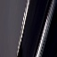    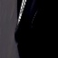      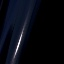        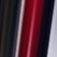  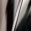    

And 19034 images of Non-Cars:

  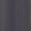  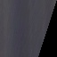  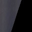            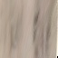  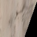  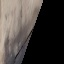

In order to be brief, we will not go into details of how we extracted the dataset from the training video, and our highly manual intensive methods of separating and classifying the dataset once collected in this report, nor our data segmentation methods, since they are out of scope for this project.  You may view a small single image sample of our data collection here:  [./collected/20170124183835/](./collected/20170124183835/)

We use the following code segment to read and process the path to the images:

```
# Divide up into cars and notcars
cars = glob.glob('../vehicles/*/*/*.jpg')
notcars = glob.glob('../non-vehicles/*/*/*.jpg')

print("number of original car samples: ", len(cars))
print("number of original non-car samples: ", len(notcars))
```

and then read them in as images as part of the extract_features() function as shown in the following code segment:

```
# Define a function to extract features from a list of images
# Have this function call bin_spatial() and color_hist()
def extract_features(imgs, cspace='RGB', spatial_size=(32, 32),
                        hist_bins=32, hist_range=(0, 256), orient=9,
                        pix_per_cell=8, cell_per_block=2, hog_channel=0,
                        datatype='', visualize=False):
    # Create a list to append feature vectors to
    features = []
    # Iterate through the list of images
    images_pbar = tqdm(range(len(imgs)), desc='Loading '+datatype+' Dataset', unit=' features')
    for i in images_pbar:
        file = imgs[i]
        # Read in each one by one
        image = cv2.cvtColor(cv2.imread(file), cv2.COLOR_BGR2RGB)
    ...
```

### 2.3 HOG Feature Set Exploration

Once we read in the vehicle and non-vehicle dataset, we explored different HOG features that we could extract and test.  After each run, the result of the model was saved as well as its scaled_X transform with `scikit-learn` `joblib.dump()` function.  We will use the best saved model for our final vehicle detection implementation in our pipeline.  The following table shows the HOG features we explored and their training statistics:

| HOG Name | Color Space | HOG Channel | Orientation | Pixel/Cell | Cell/Block | Jittered | Train Accuracy | Test Accuracy | Decision Time |
| :---: | :---: | :---: | :---: | :---: | :---: | :---: | :---: | :---: | :---: |
| CHOGRGB1 | RGB | 0 | 9 | 8 | 2 | No | 0.9996 | *0.9762* | 0.000063419 secs |
| CHOGRGB2 | RGB | 0 | 8 | 4 | 2 | No | 1.0000 | 0.9643 | 0.000089645 secs |
| CHOGRGB3 | RGB | 0 | 9 | 8 | 2 | Yes | 0.9481 | 0.9620 | 0.000066042 secs
| CHOGRGB4 | RGB | 0 | 8 | 4 | 2 | Yes | 0.9946 | 0.9254 | 0.000103474 secs |
| CHOGHSV1 | HSV | 1 | 9 | 8 | 2 | No | 1.0000 | 0.9686 | 0.000062227 secs |
| CHOGLUV1 | LUV | 1 | 9 | 8 | 2 | No | 1.0000 | 0.9718 | 0.000062466 secs |
| CHOGHLS1 | HLS | 2 | 9 | 8 | 2 | No | 0.9999 | 0.9677 | **0.000046730 secs** |
| CHOGYUV1 | YUV | 0 | 9 | 8 | 2 | No | 1.0000 | **0.9815** | 0.000062227 secs |
| CHOGYUV2 | YUV | 0 | 9 | 4 | 2 | No | 1.0000 | 0.9671 | 0.000095844 secs |
| CHOGGRAY1 | Grayscale | Grayscale | 9 | 8 | 2 | No | 1.0000 | 0.9258 | 0.000076294 secs |
| CHOGRGB5 | RGB | 0 | 9 | 2 | 2 | Yes | 1.0000 | 0.8992 | *0.000188828 secs* |
| CHOGGRAYRGB1 | Both Grayscale and RGB | Grayscale | 9 | 4 | 2 | No | 1.0000 | 0.9664 | 0.000090599 secs |
| CHOGHLS2 | HLS | 2 | 9 | 4 | 2 | No | 1.0000 | 0.9673 | 0.000097036 secs |

We then applied the binned color features and the histograms of color in the color space to the HOG feature vector, except for the CHOGGRAY1, which only has the Histogram of Oriented Gradients vectors.  After forming the feature vector, it is then normalized using the `Sci-Kit Learn` `StandardScaler` function to normalize the vector before training with the SVM linear classifier.

The HOG feature set for CHOGYUV1 seems to have the best accuracy, 0.9815; follow closely by CHOGRGB1 with 0.9762 accuracy.  CHOGHLS1 had the best timing with just 0.00004673 seconds to do a *decision_function()*, but with a lower accuracy of 0.9677.  The following subsections will show 13 HOG features we explored briefly.

#### 2.3.1 CHOGRGB1 HOG Features

We first explored the RGB color space with Red (0) as the primary HOG channel.  Since we already show all the results in the table in section 2.3, we will just show what the feature from the `skimage.hog()` output looks like.  The code that train this HOG feature is [vehicleLab/chogtrainingRGB1.py](./vehicleLab/chogtrainingRGB1.py)


#### 2.3.2 CHOGRGB2 HOG Features

We continue to explored the RGB color space with Red (0) as the primary HOG channel, but with different orientation, pixel/cell and cell/block combinations.  Since we already show all the results in the table in section 2.3, we will just show what the feature from the `skimage.hog()` output looks like.  It appears that increasing the resolution of the HOG features actually lowered its accuracy.  The code that train this HOG feature is [vehicleLab/chogtrainingRGB2.py](./vehicleLab/chogtrainingRGB2.py)

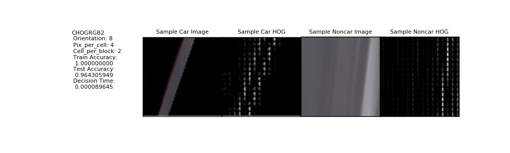

#### 2.3.3 CHOGRGB3 HOG Features

We continue to explored the RGB color space with Red (0) as the primary HOG channel with the same orientation, pixel/cell and cell/block combinations as CHOGRGB1, but with a subset of jitter patterned used for Project 2.  Since we already show all the results in the table in section 2.3, we will just show what the feature from the `skimage.hog()` output looks like.  It appears that jittering input to the HOG features actually lowered its accuracy, in both training and testing.  The code that train this HOG feature is [vehicleLab/chogtrainingRGB3.py](./vehicleLab/chogtrainingRGB3.py)

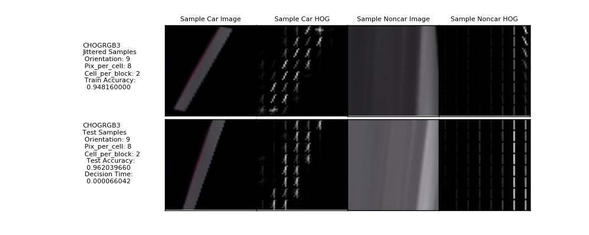

#### 2.3.4 CHOGRGB4 HOG Features

We continue to explored the RGB color space with Red (0) as the primary HOG channel with the same orientation, pixel/cell and cell/block combinations as CHOGRGB2, but with a subset of jitter patterned used for Project 2.  Since we already show all the results in the table in section 2.3, we will just show what the feature from the `skimage.hog()` output looks like.  Again, it appears that jittering input to the HOG features actually lowered its accuracy.  This time training accuracy not as much.  The code that train this HOG feature is [vehicleLab/chogtrainingRGB4.py](./vehicleLab/chogtrainingRGB4.py)

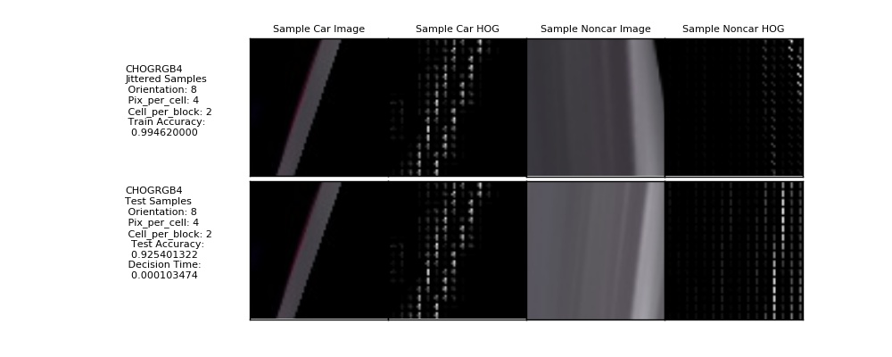

#### 2.3.5 CHOGHSV1 HOG Features

We continue to explored the HSV color space with Saturation (1) as the primary HOG channel with the same orientation, pixel/cell and cell/block combinations as CHOGRGB1.  Since we already show all the results in the table in section 2.3, we will just show what the feature from the `skimage.hog()` output looks like.  We find similar results as CHOGRGB1 with higher accuracy for CHOGRGB1.  The code that train this HOG feature is [vehicleLab/chogtrainingHSV.py](./vehicleLab/chogtrainingHSV.py)


#### 2.3.6 CHOGLUV1 HOG Features

We continue to explored the HSV color space with U (1) as the primary HOG channel with the same orientation, pixel/cell and cell/block combinations as CHOGRGB1.  Since we already show all the results in the table in section 2.3, we will just show what the feature from the `skimage.hog()` output looks like.  We find lower results than the rest of the HOG features.  The code that train this HOG feature is [vehicleLab/chogtrainingLUV.py](./vehicleLab/chogtrainingLUV.py)


#### 2.3.7 CHOGHLS1 HOG Features

We continue to explored the HLS color space with Saturation (2) as the primary HOG channel with the same orientation, pixel/cell and cell/block combinations as CHOGRGB1.  Since we already show all the results in the table in section 2.3, we will just show what the feature from the `skimage.hog()` output looks like.  We find lower results than the rest of the HOG features.  The code that train this HOG feature is [vehicleLab/chogtrainingHLS1.py](./vehicleLab/chogtrainingHLS1.py)


#### 2.3.8 CHOGYUV1 HOG Features

We continue to explored the YUV color space with Y (Luma - 0) as the primary HOG channel with the same orientation, pixel/cell and cell/block combinations as CHOGRGB1.  Since we already show all the results in the table in section 2.3, we will just show what the feature from the `skimage.hog()` output looks like.  We find an accuracy result better than CHOGRGB1.  The code that train this HOG feature is [vehicleLab/chogtrainingYUV1.py](./vehicleLab/chogtrainingYUV1.py)

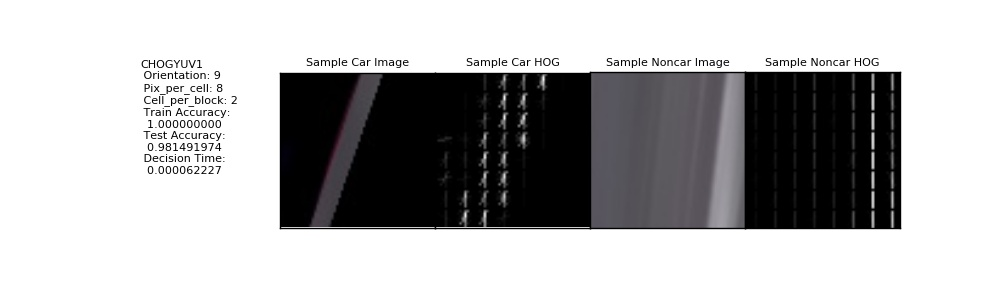

#### 2.3.9 CHOGYUV2 HOG Features

We continue to explored the YUV color space with Y (Luma - 0) as the primary HOG channel with the same orientation, pixel/cell and cell/block combinations as CHOGRGB2.  Since we already show all the results in the table in section 2.3, we will just show what the feature from the `skimage.hog()` output looks like.  This time, we find an accuracy result similar to CHOGRGB1.  The code that train this HOG feature is [vehicleLab/chogtrainingYUV2.py](./vehicleLab/chogtrainingYUV2.py)


#### 2.3.10 CHOGGRAY1 HOG Features

We continue to explored but now using Grayscale as the primary HOG channel with the same orientation, pixel/cell and cell/block combinations as CHOGRGB1.  Since we already show all the results in the table in section 2.3, we will just show what the feature from the `skimage.hog()` output looks like.  This time, we find an accuracy result one of the lowest thus far.  The code that train this HOG feature is [vehicleLab/chogtrainingGray1.py](./vehicleLab/chogtrainingGray1.py)


#### 2.3.11 CHOGRGB5 HOG Features

We continue to explored RGB color space with Red (0) as the primary HOG channel with a jitter combination and a new orientation, pixel/cell and cell/block combinations.  Since we already show all the results in the table in section 2.3, we will just show what the feature from the `skimage.hog()` output looks like.  This time, we find the lowest accuracy result, so jittering and increasing resolution does not seem like a good combination for training HOG features in a Linear SVM classifier.  Also, this HOG feature had the highest decision time of 0.000188828 seconds.  The code that train this HOG feature is [vehicleLab/chogtrainingRGB5.py](./vehicleLab/chogtrainingRGB5.py)

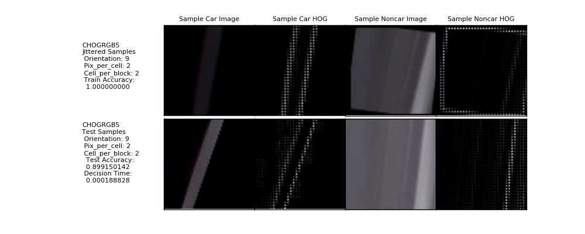

#### 2.3.12 CHOGGRAYRGB1 HOG Features

We continue to explored but now using Grayscale as the primary HOG channel with added RGB color histograms and the same orientation, pixel/cell and cell/block combinations as CHOGRGB2.  Since we already show all the results in the table in section 2.3, we will just show what the feature from the `skimage.hog()` output looks like.  The code that train this HOG feature is [vehicleLab/chogtrainingGrayRGB.py](./vehicleLab/chogtrainingGrayRGB.py)

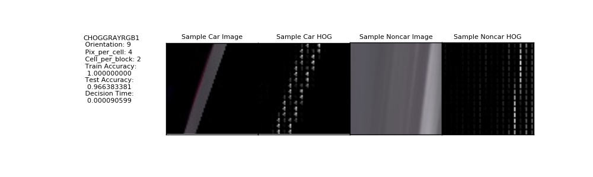

#### 2.3.13 CHOGHLS2 HOG Features

This is the last HOG feature set we will explore.  It is based on the HLS color space with Saturation (2) as the primary HOG channel with a jitter combination and a new orientation, pixel/cell and cell/block combinations.  Since we already show all the results in the table in section 2.3, we will just show what the feature from the `skimage.hog()` output looks like.  This time, we find a lower accuracy result.  The code that train this HOG feature is [vehicleLab/chogtrainingHLS2.py](./vehicleLab/chogtrainingHLS2.py)


### 2.3.14 HOG Final Feature Selection

At the end of this exploration, we wanted to decide on either **CHOGYUV1** or **CHOGHLS1** HOG features.  One gave us the highest test accuracy while the other gave us the fastest decision time.  However, we will delay this decision because we want to see how well they perform in a sliding window search.

### 2.4  Sliding Windows Search

To implement a sliding window search, we need to decide what size window we want to search, where in the image we want to start and stop our search, and how much we want windows to overlap.  On top of that any size window patch we want to make bigger than the 64x64 image samples we use to train our HOG feature Linear SVM classifier on would have to be resized, a time and CPU resource intensive task.  We decided to start with a 128x128 and 64x64 sets of 50% overlapping between windows in both vertical and horizontal dimensions.  This was our initial sliding window pattern:

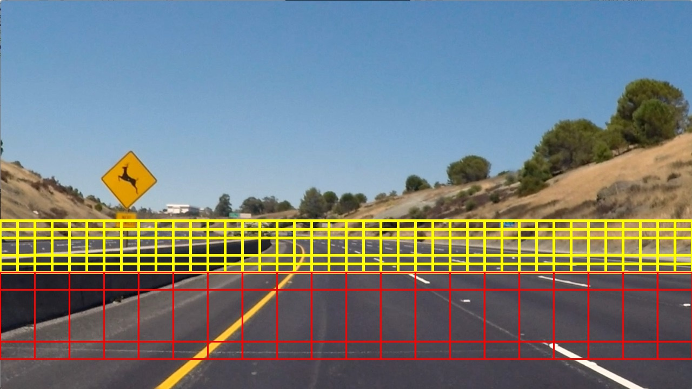

This produced searches that had a lot of fault positives, and were too time consuming.  Took as much as a second per frame without even putting in effort to get rid of fault positives.  It was not very satisfying.

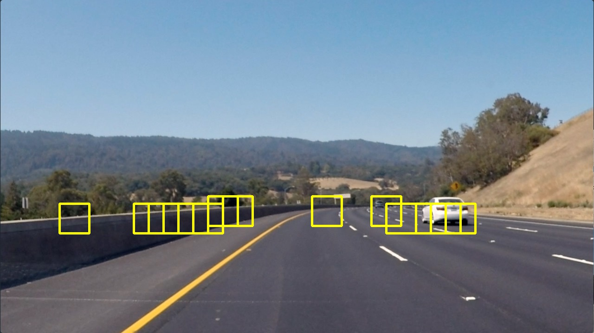

We could have removed all of the windows on the left to reduce our fault positives and, at the same time, reduce our time spent to almost half, but that seem just going half way, and we do not gain additional features either.  On the whole, not satisfying either.

We decided to look at our previous **Project 4, Advanced Lane Finding** and previous lessons for inspiration.  And thought of if only we could deploy a similar trick that Support Vector Machines (SVM) uses: the **Kernel Trick.**  The **Kernel Trick** makes a problem that is hard to solve linearly by transforming the problem space to a higher dimension to make it linearly solvable.  The following picture explains the idea well:

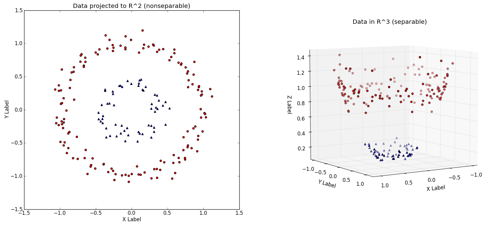

Consider you are trying to separate the data points represented by the red dots from the blue dots on the left chart.  How can we do using a linear separator?  The answer is to project the points to a higher 3rd dimensional space and then separate them there with a plane as depected on the right.  There is an exellent article about this here: [http://www.eric-kim.net/eric-kim-net/posts/1/kernel_trick.html](http://www.eric-kim.net/eric-kim-net/posts/1/kernel_trick.html).

So, what have we learned from previous projects and lesson that can help?  Then the idea of the unwarping from perspective to birds-eye view came to mind and why that was necessary for measuring the curvature of the road.  If only we could use that somehow.  Part of the problem is that even if we could do this, the birds-eye view's resolution was not good enough.  We have too much noise in the image to do the sliding window detection.  But it was something to think about, so why not give it a try?

### 2.5 Birds-eye View as a Kernel Trick

The first problem to solve is the resolution.  How do we increase the resolution of the 'birds-eye' view?  Recall this was the best we could do for **Project 4: Advanced Lane Finding**:

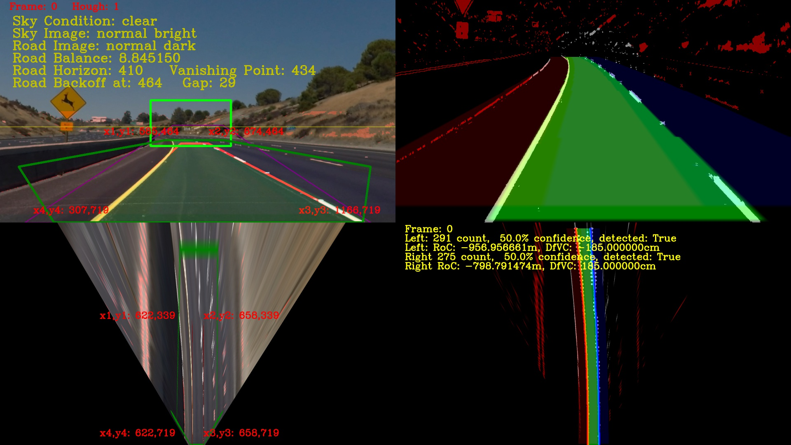

While it is pretty good, as you may notice, the width of the lanes are just 36 pixels wide.  May not be a good enough resolution with what we have in mind.  So, if we keep projecting the perspective image to the same 1280x720 resolution image, then nothing will change.  Can we project the 'birds-eye' view to a higher resolution image?  The answer turn out to be *Yes*!  Most of the example given in OpenCV on doing the `OpenCV` `cv2.warpPerspective()` function warps the projection back to the same size image; however, if you look at the documentation [here](http://docs.opencv.org/2.4/modules/imgproc/doc/geometric_transformations.html).  There is nothing in the document that saids the destination has to be the same size image, so why not use a Full HD size resolution?  Our first attempt was this:

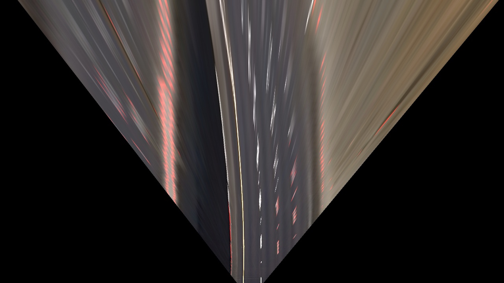

Which is not bad.  Our pixel between the lane lines just got a lot better at around 54 pixels apart.  But if only we could project deeper into the horizon.  As it turns out, we can!  There is nothing that says we need to keep the wider part of the image at 1920 pixel in the horizontal axis.  Why not rotate it 90 degrees and make it a verticle axis instead so we can look deeper into the horizon?  Here is the result:

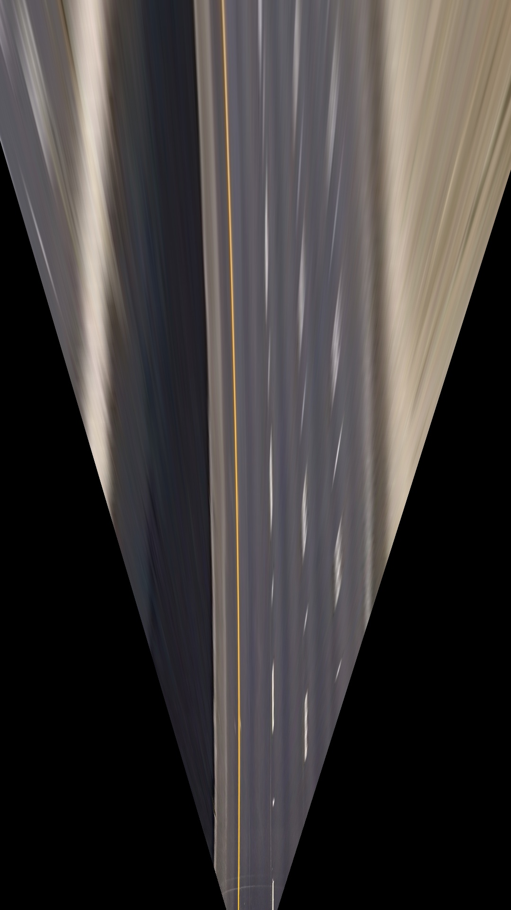

*Wow!*  The lane lines on the other lanes are clearly visible now.  Can we find those lanes as well?  As it turns out, we can!  Here are some results we can now achieve with this resolution (Solid White):

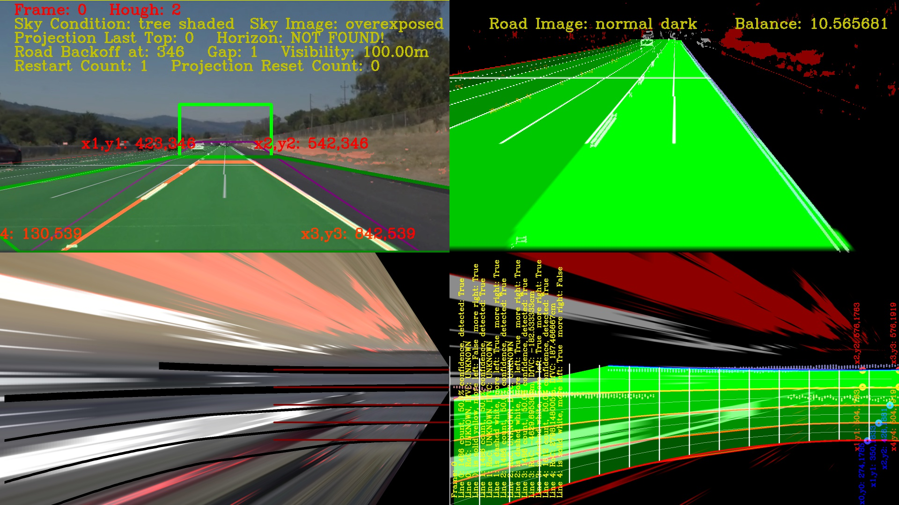

The algorithm could not look past the 4th lane line and see the additional 2 beyond them in the following image (Solid Yellow), but if we had a full HD 1920x1080 perspective image instead of the 1280x720, then that may well change!  Perticularly if we project the 'birds-eye' view into a 4K resolution:

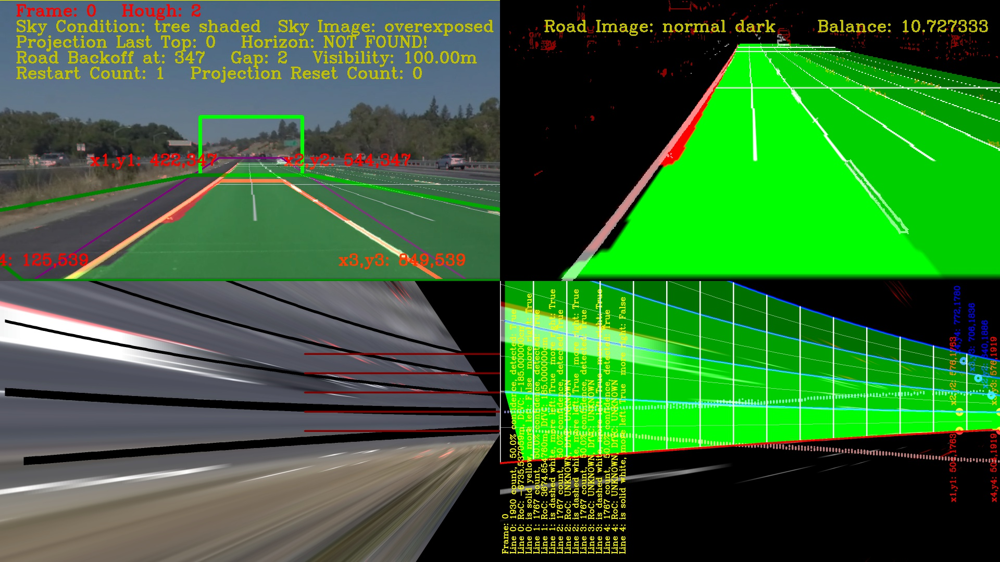

Now our lane lines are a little more than 64 pixels apart.  Good enough for our classifier to run without having to resize!  Yeah!  Now we have to decide how to place our sliding windows in 'birds-eye' view.

*NOTE:  You may have notice that the 'birds-eye' view of the lanes in the last picture seems warped at the top, and wonder why that is.  We were stratching our heads as well, until we recalled that the projection that we are using is a plane with no* **z** *values.  What this is really telling us, is that when we did the projection, it was too low for points near the* **horizon** *and* **vanishing point**.  *In other words, beyond the rectangle we mapped on our road to do the 'birds-eye' view projection, we are going* **up hill**!  *The gradient of the road surface is going up, but we have no way to adjust this in the planar projection scheme.  There are ways around this; however, it is currently beyond the scope of this project.  Some future topic for research as we will discuss in section 4!*

### 2.6 Birds-eye View as a Sliding Window Canvas

One of the problems with perspective images, is that things far away are much smaller in scale and may even have different shapes when view near.  *Recall the camera calibration discussion, distortion and pin-hole camera model in Project 4.*

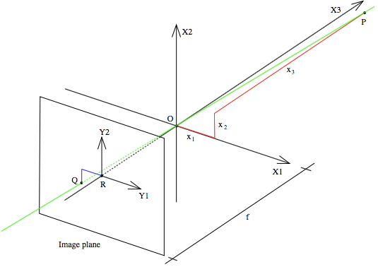

The sliding windows with multiple sizes and overlaps were made to resolve these problems.  But other problems come up because our sliding window may look at trees and concrete dividers and decides those are vehicles too.  Now that we created a **Kernel Trick** and projected the perspective image plane into a higher 3rd dimension and then reprojected down to a 'birds-eye' view, did we gain linear separability?  The answer is *Yes* because its like the **SVM** **Kernel Trick**, our 'birds-eye' view is the linear separator!  We no longer have to worry about trees or the sky in the image because they would never get projected into a 'birds-eye' view!  With the 'birds-eye' view, we can clearly see the lane division and, at the same time, we notice what belongs in those lanes, *other vehicles* that we need to **detect** and **track**!  But, we still do not not have a good idea if our new sliding window canvas can be used to detect vehicles by our trained linear classifier, nor where to place those sliding windows.  The answer, it turns out, is that we just need those detectors on the lanes because once we detect them, they will be easy to track on the 'birds-eye' view.  There is nowhere for them to disappear to because they are the same size and shape when projected to a map surface.  Here is a view where we lay down a wire frame to the lane surface to get a good idea of how uniform the surface is:

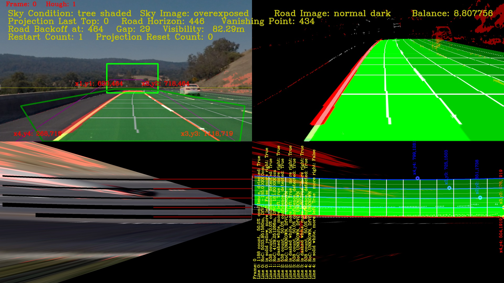

They are clearly mapped correctly, but so, how do we calculate where those sliding windows belong?  While we were testing the uniformity of the surface, we were playing with the polynomials that made up the lane lines.  As it turns out, we could interpolate and do calculations on them too and can find the location of the lanes and get their centers.  Recall we now have a shared array of lines that are managed by an array of lane classes?  Here is how we use them in the code to decide where to search for vehicles in the 'birds-eye' view:

```
    # specialized sliding window generation.
    # we are looking at top down birds-eye view and
    # limiting the detection to just the lanes.
    # we need to use the lane lines to help generate the sliding window
    # locations.
    def slidingWindows(self, lines, laneIdx, complete=False):
        # initial empty window list
        window_list = []

        # calculate the window positions
        nlanes = len(lines) - 1
        for i in range(nlanes):
            leftPolynomial = np.poly1d(lines[i].currentFit)
            rightPolynomial = np.poly1d(lines[i + 1].currentFit)

            # horizontal lines
            # we treat left and right lanes differently because of the
            # projection.  In the 'complete' case we are getting all
            # of the sliding windows
            if complete:
                if i < laneIdx:
                    indexedBottom = i + 1
                else:
                    indexedBottom = i
                for j in range(
                        int(lines[indexedBottom].bottomProjectedY / 32)):
                    y1 = 32 * j
                    mid = int(
                        (rightPolynomial([y1]) +
                         leftPolynomial([y1])) / 2)
                    x1 = mid - 32
                    x2 = mid + 32
                    y2 = y1 + 64
                    if (x1 > 0 and x2 < self.projectedX and
                            y1 > 0 and y2 < self.projectedY):
                        window_list.append(((x1, y1), (x2, y2)))

            # In the else case we are getting only the windows at the top
            # and bottom of our lanes for the sliding windows
            else:
                linetop = lines[i].getTopPoint()
                if i == laneIdx:
                    ylist = [linetop[1], linetop[1] + 32, linetop[1] + 64]
                elif i < laneIdx:
                    ylist = [linetop[1],
                             linetop[1] + 32,
                             linetop[1] + 64,
                             lines[i].bottomProjectedY - 128,
                             lines[i].bottomProjectedY - 64,
                             lines[i].bottomProjectedY]
                else:
                    ylist = [linetop[1],
                             linetop[1] + 32,
                             linetop[1] + 64,
                             lines[i + 1].bottomProjectedY - 64,
                             lines[i + 1].bottomProjectedY,
                             lines[i + 1].bottomProjectedY + 64]

                for y1 in ylist:
                    mid = int(
                        (rightPolynomial([y1]) + leftPolynomial([y1])) / 2)
                    x1 = mid - 32
                    x2 = mid + 32
                    y2 = y1 + 64
                    if (x1 > 0 and x2 < self.projectedX and
                            y1 > 0 and y2 < self.projectedY):
                        window_list.append(((x1, y1), (x2, y2)))
        return window_list
```

You will notice that there is a `complete` flag in the parameter to the slidingWindows function.  This is so that in the an image or in the early stages of a video, we need to do a complete scan of the lanes to detect all of the vehicles.  However, later in a video, we don't have to be so aggressive in our search, since vehicles already found are now tracked.  We just need to detect new vehicles entering into our scanning area.  So, just the top or the bottom of the lanes!  Here is something to help you with the idea.  This is where all of the sliding windows are when we do a full scan of the trackable area as calculated by the algorithm above:

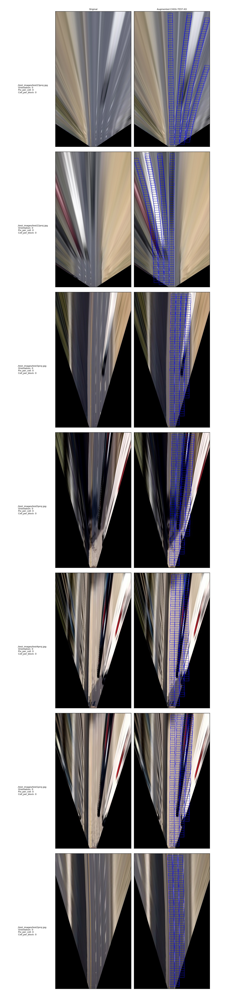

And this is what it looks like when we do a *sentinel* scan:

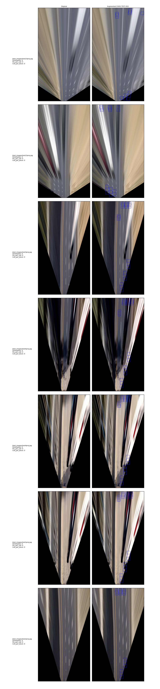

A lot fewer sliding windows to manage and search per frame.  So, how well does it work?  Let's test it out in the next section.

*NOTE: You may notice that the lane lines are masked out and removed in some of the earlier images.  Since we already know where the lane lines are, this is to keep the vehicle detector from using them to find false positives.  However, we found a different method on how to more accurately do this and we will discuss this later in section 3, Video Pipeline.*

### 2.7 `Predict` versus `Decision_Function`

The first pass on our test using the `predict()` function for seeing classifications did not turn out very well.  A lot of times, our HOG features predicted road surfaces as cars when they simply were not.  See example below:


We were stratching our heads trying to figure out why, since this was a very successful HOG feature set during training, until we found this information in the Scikit Learn site: [1.4.1.2.  SVM Scores and probabilities](http://scikit-learn.org/stable/modules/svm.html#scores-and-probabilities)

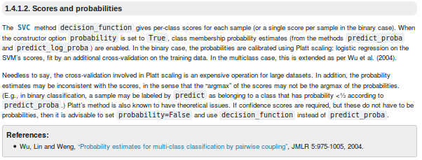

Now it becomes clear that we should not be using the `predict()` function, and should use `decision_function()` instead.  Particularly since `cross-validation` involved in *Platt scaling*, as stated here, is an expensive operation and probability inconsistent as well in determining binary classification.  In our case, **vehicle** or **not vehicle**.  So, we will abandon the `predict()` function in favor of using the `decision_function`, but first we need to find out the `decision_function` dynamic range for our HOG features before proceeding.

### 2.7 Sliding Windows on 'Birds-eye' View Canvas Results

Recall our results from our earlier tests, we expected the CHOGYUV1 to be the best detector of vehicles out of our 13 trained HOG features set; however, as we will soon see, this is not the case for us in this new approach.  The next set of subsections describes the results of using the Linear SVM classifiers with sliding windows on our new higher resolution 'Birds-eye' view canvas.

#### 2.7.1 CHOGRGB1 HOG Features Sliding Window Test Results (Final)

This HOG Feature dynamic range is from -5 to 8.75.  At 8.75, it was able to detect most vehicles, but have some issues with false-positives still, at the lower end, it was not able to detect 4 of the vehicles in test22.  So we will pass on this HOG feature for the next phase.

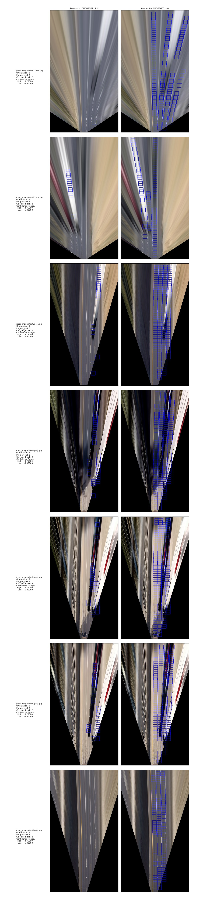

#### 2.7.2 CHOGRGB2 HOG Features Sliding Window Test Results (Final)

This HOG Feature performed a bit better than CHOGRGB1, and is able to detect an additional 2 vehicles in test22, but not the entire set, so we will pass on this HOG feature.

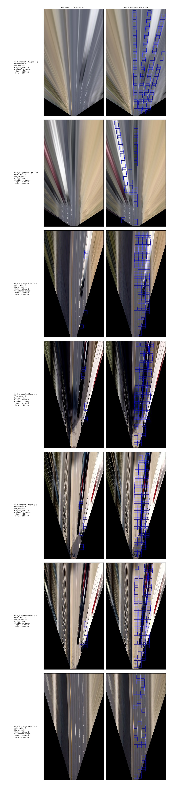

#### 2.7.3 CHOGRGB3 HOG Features Sliding Window Test Results  (Final)

This HOG Feature has the good dynamic range from -1.75 to 5.75.  At the lowest range it is able to detect all of the vehicles with the least false-positives and at the high range, it gave no false-positives.  Approved for next phase of investigation.

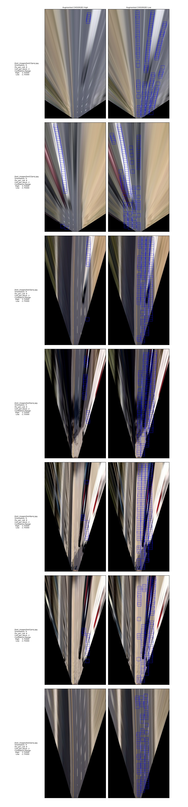

#### 2.7.4 CHOGRGB4 HOG Features Sliding Window Test Results (Final)

This HOG Feature has the best dynamic range from -0.25 to 10.15.  At the lowest range it is able to detect all of the vehicles and at the high range, it gave no false-positives.  Approved for next phase of investigation.

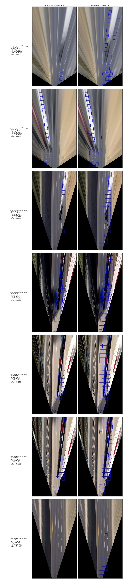

#### 2.7.5 CHOGHSV1 HOG Features Sliding Window Test Results (Final)

This HOG Feature performed similar to CHOGRGB1, and is able to detect 3 vehicles in test22, but not the entire set.  We will pass on this one as well.

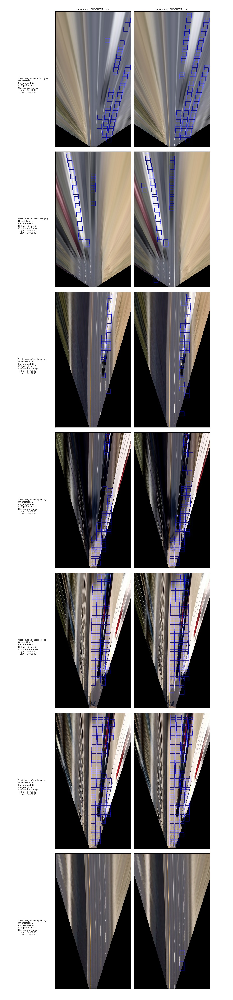

#### 2.7.6 CHOGLUV1 HOG Features Sliding Window Test Results (Final)

This HOG Feature behaved almost the same as CHOGHSV1 except slightly worst.  Although it did well with test22 image, it had too many false positive with the rest of the test images, and is therefore disqualified also from further investigation.

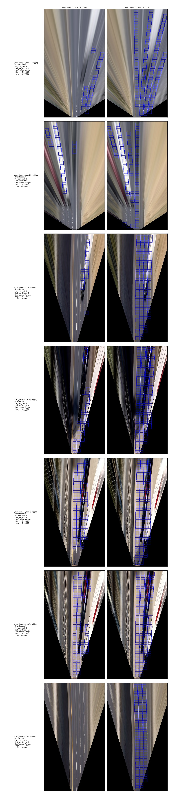

#### 2.7.7 CHOGHLS1 HOG Features Sliding Window Test Results (Final)

This HOG Feature dynamic range was not acceptable.  At the lower end of -5.0, it was still not able to detect some of the vehicles in test22, and at the higher range, it had too many false-possitives.  So, we will pass on this one too.

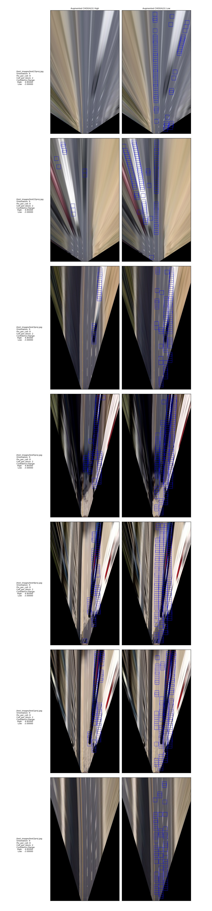

#### 2.7.8 CHOGYUV1 HOG Features Sliding Window Test Results (Final)

We expected great things from this HOG feature, but its dynamic range was not acceptable.  Even with a high of 120, it was still giving false-positives, and at the lower range of -3, it was still not able to detect 1 vehicle in test22.  We will not continue further with this HOG feature.

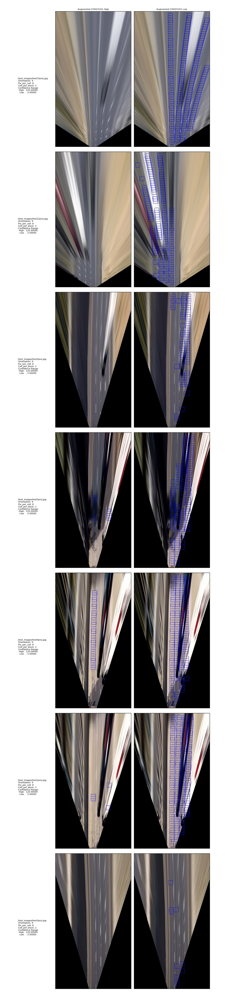

#### 2.7.9 CHOGYUV2 HOG Features Sliding Window Test Results (Final)

The result of this HOG feature is similar to CHOGYUV1, and is therefore, not recommended for the next phase of investigation.

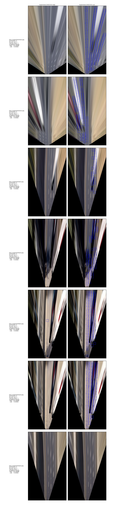

#### 2.7.10 CHOGGRAY1 HOG Features Sliding Window Test Results (Final)

This HOG feature resulted in less false positive than the HOGs using YUV color space, however, it was not able to detect all of the vehicles in test22 even at the low range of -5 and was not able to detect some of the vehicles in the higher range, especially the black one.  We will pass on this as well.

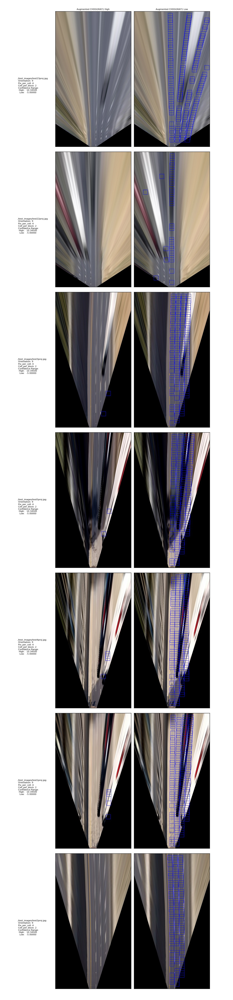

#### 2.7.11 CHOGGRAYRGB1 HOG Features Sliding Window Test Results (Final)

This HOG feature was about the same as CHOGGRAY1 and hardly detected any vehicles especially the black colored car.  We will pass on this one.

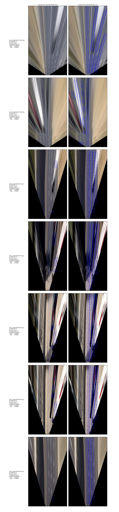

#### 2.7.12 CHOGRGB5 HOG Features Sliding Window Test Results (Final)

Like the others, this HOG feature dynamic range was not very good.  At the lower end, it was not able to detect 3 vehicles in test22 and at the higher range, it was still getting a false-positive.  Will pass.

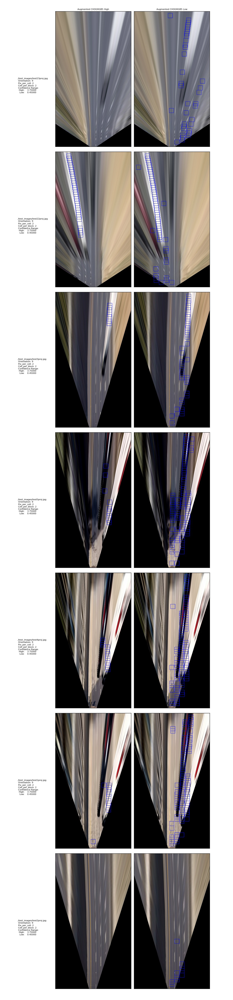

#### 2.7.13 CHOGHLS2 HOG Features Sliding Window Test Results (Final)

This HOG feature is like most of the others, at the higher range, it was still detecting false-positves while at the lower end, was not able to detect all of the vehicles in test22.

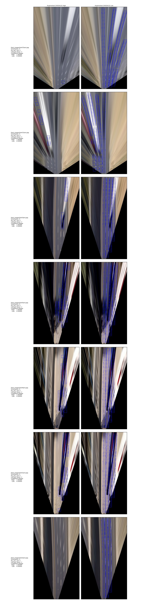

#### 2.7.14 Recommendation for Video Testing

It is interesting that even though **CHOGYUV1**, **CHOGRGB1** and **CHOGLUV1** all scored relatively high in test accuracy compared to the rest of the HOG features trained to detect vehicles, they did not performed well in the sliding window testing with the 'birds-eye' view canvas.  Just goes to show you need to keep an open mind when investigating!


| HOG Name | Next Phase? | Color Space | HOG Channel | Orientation | Pixel/Cell | Cell/Block | Jittered | Train Accuracy | Test Accuracy | Prediction Time |
| :---: | :---: | :---: | :---: | :---: | :---: | :---: | :---: | :---: | :---: | :---: |
| CHOGRGB1 | *No* | RGB | 0 | 9 | 8 | 2 | No | 0.9996 | *0.9762* | 0.000063419 secs |
| CHOGRGB2 | *No* | RGB | 0 | 8 | 4 | 2 | No | 1.0000 | 0.9643 | 0.000089645 secs |
| CHOGRGB3 | **Candidate 1** | RGB | 0 | 9 | 8 | 2 | Yes | 0.9481 | 0.9620 | 0.000066042 secs
| CHOGRGB4 | **Candidate 2** | RGB | 0 | 8 | 4 | 2 | Yes | 0.9946 | 0.9254 | 0.000103474 secs |
| CHOGHSV1 | *No* | HSV | 1 | 9 | 8 | 2 | No | 1.0000 | 0.9686 | 0.000062227 secs |
| CHOGLUV1 | *No* | LUV | 1 | 9 | 8 | 2 | No | 1.0000 | 0.9718 | 0.000062466 secs |
| CHOGHLS1 | *No* | HLS | 2 | 9 | 8 | 2 | No | 0.9999 | 0.9677 | **0.000046730 secs** |
| CHOGYUV1 | *No* | YUV | 0 | 9 | 8 | 2 | No | 1.0000 | **0.9815** | 0.000062227 secs |
| CHOGYUV2 | *No* | YUV | 0 | 9 | 4 | 2 | No | 1.0000 | 0.9671 | 0.000095844 secs |
| CHOGGRAY1 | *No* | Grayscale | Grayscale | 9 | 8 | 2 | No | 1.0000 | 0.9258 | 0.000076294 secs |
| CHOGRGB5 | *No* | RGB | 0 | 9 | 2 | 2 | Yes | 1.0000 | 0.8992 | *0.000188828 secs* |
| CHOGGRAYRGB1 | *No* | Both Grayscale and RGB | Grayscale | 9 | 4 | 2 | No | 1.0000 | 0.9664 | 0.000090599 secs |
| CHOGHLS2 | *No* | HLS | 2 | 9 | 4 | 2 | No | 1.0000 | 0.9673 | 0.000097036 secs |

## 3 Video Pipeline

This section we will describe how we implemented the video pipeline using our Project 4 pipeline implementation as a start.  As we all know by now, the new implementation has a new projection manager that warps the 'birds-eye' view image to a resolution of 1080x1920 pixels.  This helps us with the locating the lane lines and tracking extra lanes that the vehicles that we wish to detect are on.  Then we will implement a linear SVM classifier using a candidate HOG feature identified in section 2.7.14 and view the performance of the pipeline.  But first we need to figure out how to draw a bounding box around the target vehicle once it is found in 'birds-eye' view back into perspective.

### 3.1 Enhanced Projection Manager

Recall that the **Projection Manager** [./p5lib/projectionManager.py](./p5lib/projectionManager.py) maps our image plane to a 'birds-eye' view plane to map the lane lines.  It was able to project the pixel in (x,y) coordinates from the image plane and send it down to the 'birds-eye' view plane where essentially all z coordinate values are set to 0.  That makes it hard for us to build a 3D model of the vehicle tracking that we are attempting to reconstruct.  So, somehow, we need to implement 3D reconstruction based on the information for a series of perspective pictures.  Can that be done?  Recall our pinhole camera model.  It does have a Z value transform, but for us, it has been forced to 0 when transformed into the birds-eye plane, but should be doable.

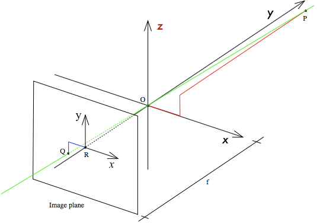

So, first we need to teach our **Projection Manager** how to project a pixel in x,y coordinates in the *birds-eye view* plane into a (x, y, z) point in the 3rd dimension and then back into a x,y coordinate pixel in the *image* plane.  Looking at the OpenCV library, we find that there is some interesting examples of how to do 3D reconstructions, so we started from there: [http://docs.opencv.org/3.0-beta/doc/py_tutorials/py_calib3d/py_pose/py_pose.html#pose-estimation](http://docs.opencv.org/3.0-beta/doc/py_tutorials/py_calib3d/py_pose/py_pose.html#pose-estimation).

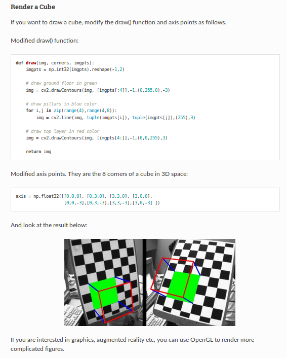

We tried using the examples and use the `cv2.solvePnPRansac`, `cv2.projectPoint` and `cv2.drawContours` functions to draw a cube on the road surface, but what was drawn did not seem right.  If you notice, the cubes are separated from the road surface, especially the cubes in the 3rd lane.  They seem to hoover about 2 feet off the ground instead of lying there where they were suppose to be projected.


Really, we cannot believe there was not a way to do this.  We search for awhile and were about to give up until we saw the following equation for the [`warpPerspective` function](http://docs.opencv.org/3.0-beta/modules/imgproc/doc/geometric_transformations.html#void%20warpPerspective).  In particular, we found this equation for doing the transform from perspective image view to 'birds-eye' planar view:

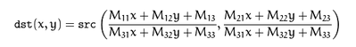

We notice that there were only *X,Y* coordinate mapping in the equation, but no *Z* to get to the 3rd dimension that we desperately wanted.  But let's think about it, what is the *Z* component on the 3rd dimention that we want to map?  If you look at the *Pin-hole Camera Model* above, the *Z* axis is the height of the objects in the 3rd dimension, and so how do we derive that from this equation?  Well, think about how we would draw something that is height related in the perspective picture.  Anything that is straight from a point on the ground would be linear straight up in the *Y* axis in the perspective picture.  So, if we think of the Destination of this equation as the results of perspective warp function, then just the y axis is mapped for height!  That means our *Z* axis component will only effect the *Y* in the perspective view.  But how does that help us?  Well, what if we re-inject the *Z* axis component, like so:

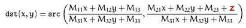

Now, does this equation make sense?  If your *Z* value is close to the you, meaning the *Y* coordinate in the 'birds-eye' view is near, the same height line will be longer in the *Y* axis when transform in perspective than a *Z* value belonging to a 3D point further away in *either* the *X* or *Y* value in the 'birds-eye' view.  That seems correct.  Why don't we try and find out by example.  Let try doing our calibration cube test again with the new equation.

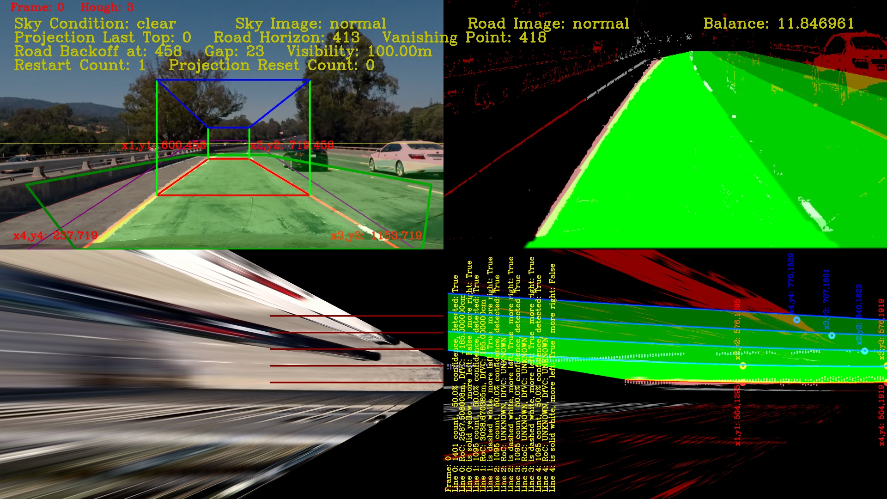

Now that looks a lot better!  In fact, using the lane lines from the polynomials, we can now create this 3D augmented scene with a rendered *Road Pathway* that we could not before:


The following is our version of the `projectPoints()` function implemented using the formula above:

```
    def projectPoints(self, birdsEye3DPoints):
        m11 = self.dst2srcM[0][0]
        m12 = self.dst2srcM[0][1]
        m13 = self.dst2srcM[0][2]
        m21 = self.dst2srcM[1][0]
        m22 = self.dst2srcM[1][1]
        m23 = self.dst2srcM[1][2]
        m31 = self.dst2srcM[2][0]
        m32 = self.dst2srcM[2][1]
        m33 = self.dst2srcM[2][2]
        x = birdsEye3DPoints[:, 0]
        y = birdsEye3DPoints[:, 1]
        z = birdsEye3DPoints[:, 2]
        size = len(birdsEye3DPoints)
        perspectiveImagePoints = np.zeros((size, 2), dtype=np.float32)
        perspectiveImagePoints[:, 0] = (
            m11 * x + m12 * y + m13) / (m31 * x + m32 * y + m33)
        perspectiveImagePoints[:, 1] = (
            m21 * x + m22 * y + m23 - z) / (m31 * x + m32 * y + m33)
        return perspectiveImagePoints
```

*NOTE: You may notice that we are using a negative* **Z** *value in our function instead of a positive one.  Why is that?  As it turns out,* **Z** *is a negative component in the equation, so in order not to force us to use a negative to express this, we choose to set the negative in the function instead.*

### 3.2 Road Grid

Now we have a way to draw 3D points, lines, curves, etc. from world coordinates to the perspective view, we need a way to map our 3D objects.  Now if you look more closely at the scene above where we drew the *Road Pathway*, you will also see a set of grid lines drawn.  This was a test to see how uniform the road surface was and if we could use it as a map for finding vehicles.  Actually, for the most part, the answer was yes.  There are some issues that we will discuss later in section 3.3, but for the most part the road surface is quite uniform.  The implementation discussed below can be found in [./p5lib/roadGrid.py](./p5lib/roadGrid.py), which is our sliding windows and voxel implimentation.

#### 3.2.1 Sentinel Sliding Windows

So, how do we search and detect vehicles on the road surface?  Don't we have the same problem as we did if we did it in perspective?  Actually, no, because, the surface of the road is usually uniform enough for us to use the same size sliding windows for detecting vehicles that we would normally have to resize for detecting vehicles that are near.  Recall the sliding window tests that we did in section 2.6.  But what about needing to scan all of the sliding windows?  Aren't they just as slow?  Well, that is interesting.  Think about this for a moment.  For the start of a video, or just an image, then yes, we may need to scan the whole surface of the roadway; however, if we have a video, we just need to do it at the beginning in the first frame.  Then after that, vehicles can only enter the scene from lanes far away near the horizon, from the back of our vehicle from other lanes left or right of us, or from an on ramp that is on the left or right of us!  That means all of the sliding window scanning that we needed to do in perspective can be pretty much turned off when we go into later frames.  Or what we call *Sentinel* mode, recall from section 2.6.

#### 3.2.2 Voxelization and Using Occlusion Culling

Ok, but besides that what else can we do to reduce our search space?  Since our solution space is now in 3D, we can use a techique called Voxel Occlusion to cull, or remove grids/sliding windows from our vehicle detection HOG feature tests.  What does that mean though?  Voxel is a rendered pixel or picture element in 3D space.  Because of occlusion, the idea is if a Voxel is in front of another, you don't need to render the Voxel behind it.  It is hidden and do not require us to traverse it in our search space.  The same idea applies for search for vehicles.  If you already know a vehicle is behind another, then that is just tracking.  If a new vehicle shows up, and it is detected, we don't need to search for anything behind it because it it hidden and cannot be seen, so would be a waste of time.  You can find more about voxel here: [https://en.wikipedia.org/wiki/Voxel](https://en.wikipedia.org/wiki/Voxel).  In particular, this paper [Voxel Occlusion Testing: A Shadow Determination Accelerator for RaY Tracing](https://pdfs.semanticscholar.org/7681/b23463516d3ef8dda39fff1be9d40a89f510.pdf) is of interest.  In it, you will find this diagram that give you a picture of what we are trying to do:

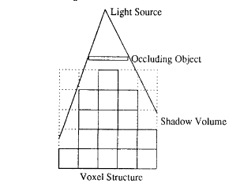

The idea is if we shoot two rays from our own vehicle position from the image plane, if we already detected another vehicle, then we don't need to scan for anything that is behind it.  Lots of our Voxel/Sliding window structure will just be eliminated from our search space due to occlusion.  To get a sense of what is the advantage of this technique, here is an example of a scene without voxel occlusion culling:

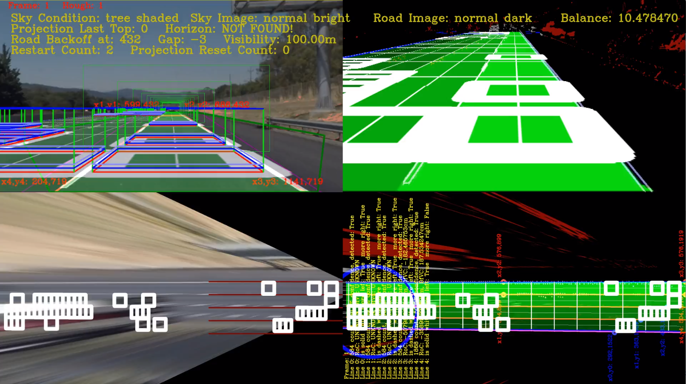

Notice that there are a lot of windows **in white** that needs to be searched.  Now, let's look at the voxel version:

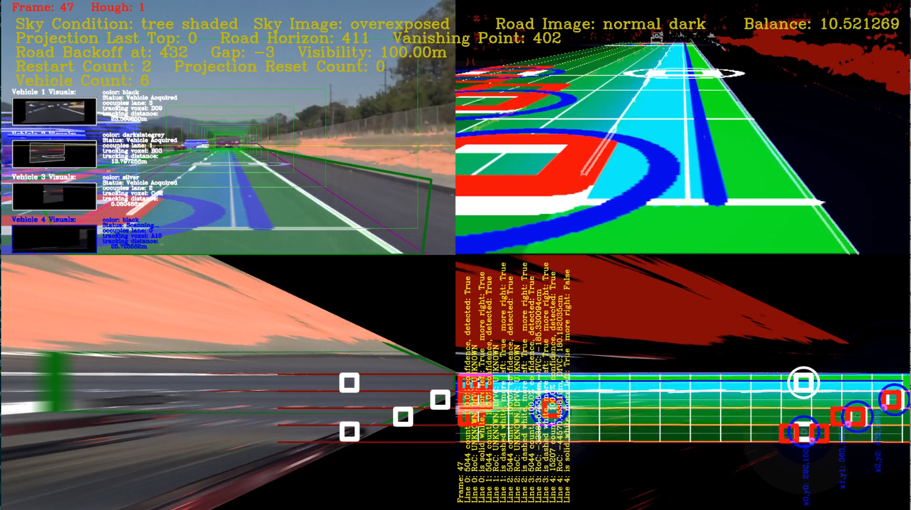

All of the *red* voxels are in occlusion mode and have stopped any search behind them.  Our search space just go a lot smaller by a factor of 10 or more!  This statagy of using a constraints in the problem space to help you quickly get to a solution by eliminating non-solutions is called **Constraint Propagation**, and is an AI problem solving techique.  Another example of its use case is to solve [Sudoku Puzzles](https://github.com/diyjac/AIND-P1).

### 3.2 Vehicle Detection

Ok, now we have our 3D voxel solution space, how do we go about detecting vehicles?  Well, recall our sliding windows and voxel implementation are one in the same, so that means as we find our vehicles using the HOG features trained vehicle SVM model, we can use the Voxel model behind it to eliminate other voxel/windows from being searched!  Here is the example code from our **VehicleDetection** class: [./p5lib/vehicleDetection.py](./p5lib/vehicleDetection.py) that does this:

```
    # Define a way for us to process an image with
    # a list of sliding windows and try to detect vehicles
    def detectVehicles(self, image, roadgrid):
        mapping = roadgrid.getMapping()
        for box in mapping.keys():
            if not mapping[box]['occluded'] and \
               not mapping[box]['found'] and \
                    mapping[box]['vehicle'] is None:
                window = mapping[box]['window']
                wimage = image[
                    window[0][1]:window[1][1],
                    window[0][0]:window[1][0]]
                wfeatures = self.extract_features(
                    wimage, cspace=self.cspace, spatial_size=(32, 32),
                    orient=self.orient, pix_per_cell=self.pix_per_cell,
                    cell_per_block=self.cell_per_block,
                    hog_channel=self.hog_channel,
                    hist_bins=32, hist_range=(0, 256))
                if wfeatures is not None:
                    confidence = self.svc.decision_function(
                        wfeatures.reshape(1, -1))
                    if confidence[0] > self.threshold:
                        roadgrid.setFound(box)
        return roadgrid
```

And in the end, we decided to use the **CHOGRGB4** HOG features with the SciKit-Learn Support Vector Machine (SVM) linear classifier: [http://scikit-learn.org/stable/modules/svm.html](http://scikit-learn.org/stable/modules/svm.html).  This HOG feature had the most dynamic range and was very responsive to vehicle detection.  So much so, we had to tune it down quite a bit to reduce its false-positves.

#### 3.2.1 Performance

So, what kind of performance did we achieve with these new techniques?  Recall we were getting around 1 seconds a frame with just processing HOG features in the perspective view, without doing any augmentation and before removing false-positives.  Did all this work make it any better?  Actually *yes!*  The 51 seconds project video with 1260 frames, took 9 minutes 35 seconds to process by this pipeline.  So, that means it processed 1260 frames in 575 seconds, or 2.19 frames per second.  So we more than eliminated half the time it would have taken to process the video using the original method, while additionally getting new features such as confirmed visuals, distance measurements and gaining the tracked vehicles' position in 3D space.  We can further improve this using additional techinques that we will mention in section 4.

```
(tensorflow) jchen@jchen-G11CD:~/SDCND/SDC-P5$ python P5pipeline.py ../CarND-Advanced-Lane-Lines/project_video.mp4 project_video_final.mp4
Camera Calibration data restored from camera_cal/calibrationdata.p
video processing ../CarND-Advanced-Lane-Lines/project_video.mp4...
[MoviePy] >>>> Building video project_video_final.mp4
[MoviePy] Writing video project_video_final.mp4
100%|█████████████████████████████████████▉| 1260/1261 [09:35<00:00,  2.23it/s]
[MoviePy] Done.
[MoviePy] >>>> Video ready: project_video_final.mp4
```

### 3.3 Vehicle Class

Once detected, our **RoadManager** create a new **Vehicle** class instance associate it with the found voxel and inserts it into an array of vehicles for further processing by the **VehicleTracking** class.  The **Vehicle** class [./p5lib/vehicle.py](./p5lib/vehicle.py) is a finite state machine that initialize and process a vehicles life cycle in our pipeline. Here are the list of its states and what they mean:

#### 3.3.1 Initialized

When the vehicle instance is first created, it goes into *initialized* state and set up its structures for initial scanning and tracking.  You can observe when the vehicle is in this state visually by looking at the vehicle's current visual status:

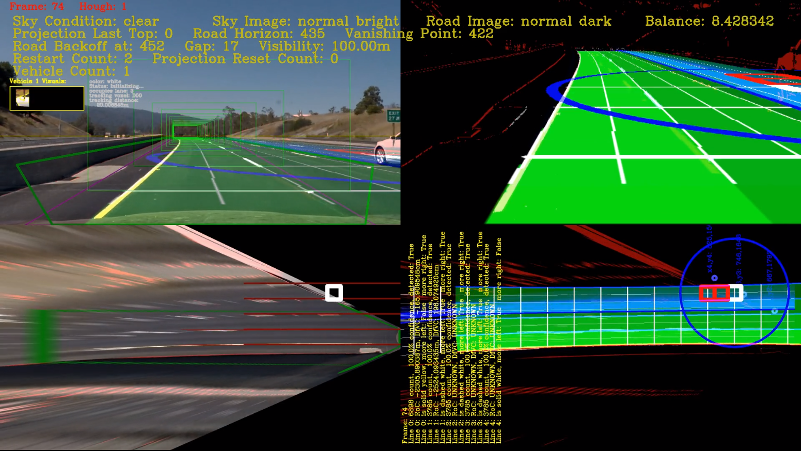

Besides the yellow border around the vehicle visual box on the left, it also shows a status of 'initializing...'.  This status will only show for a single frame.

#### 3.3.2 Detection Confirmed

After initialization, we check again to make sure that the vehicle is detected still, if it is then the vehicle instance is automatically set to Detection Confirmed state.  You can observe when the vehicle is in this state visually by looking at the vehicle's current visual status:

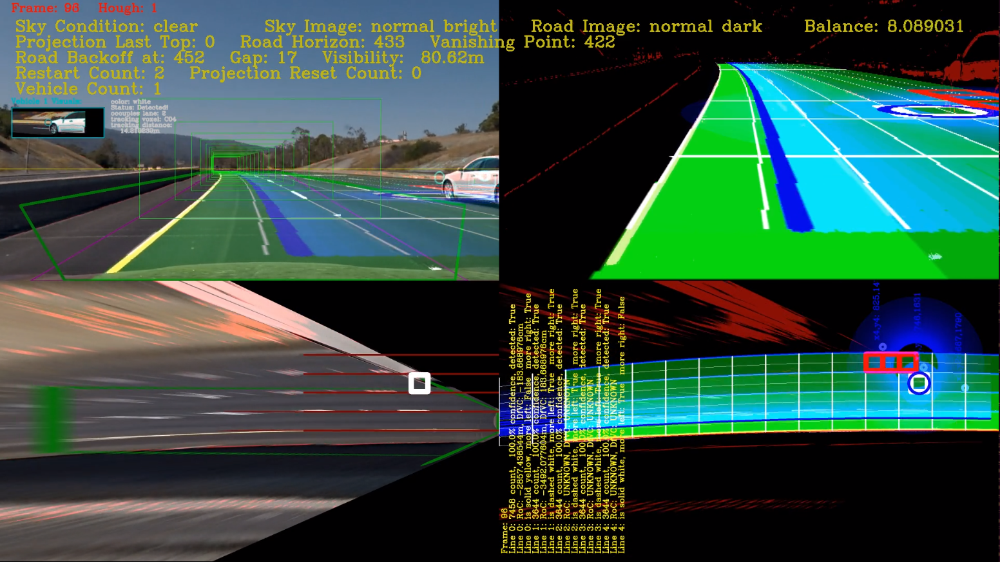

Besides the cyan (blue/green) color border around the vehicle visual box on the left, it also shows a status of 'Detected!'  This status will only show for a single frame.  before automatically going to scanning mode.

#### 3.3.3 Scanning

After Detection Confirmed, we scan the vehicle to check dimensions for tracking and make sure we can detect its color to generate a tracking mask.  You will probably notice a circle being drawn on the surface of the vehicle.  This circle is where the scanning algorithms is sampling the vehicle RGB color and generating a suitable color name to identify the vehicle.  The noticable visual in this state is the blue border around the vehicle visual and the status 'Scanning...'

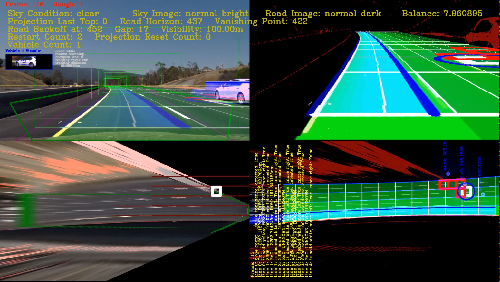

In our case, the vehicle class has identify the closest color name as 'White' using web color: [http://www.discoveryplayground.com/computer-programming-for-kids/rgb-colors/](http://www.discoveryplayground.com/computer-programming-for-kids/rgb-colors/)  After scanning is complete, the vehicle goes into Acquired state.

#### 3.3.4 Vehicle Acquired

After Scanning the vehicle goes into an Aquired state where it is ready for the **Vehicle Tracking** class to pick it up and start tracking it.  This status will only show for a single frame before automatically going to locked mode when the **Vehicle Tracking** picks it up next.  The noticable visual in this state is the white border around the vehicle visual and the status 'Vehicle Acquired'

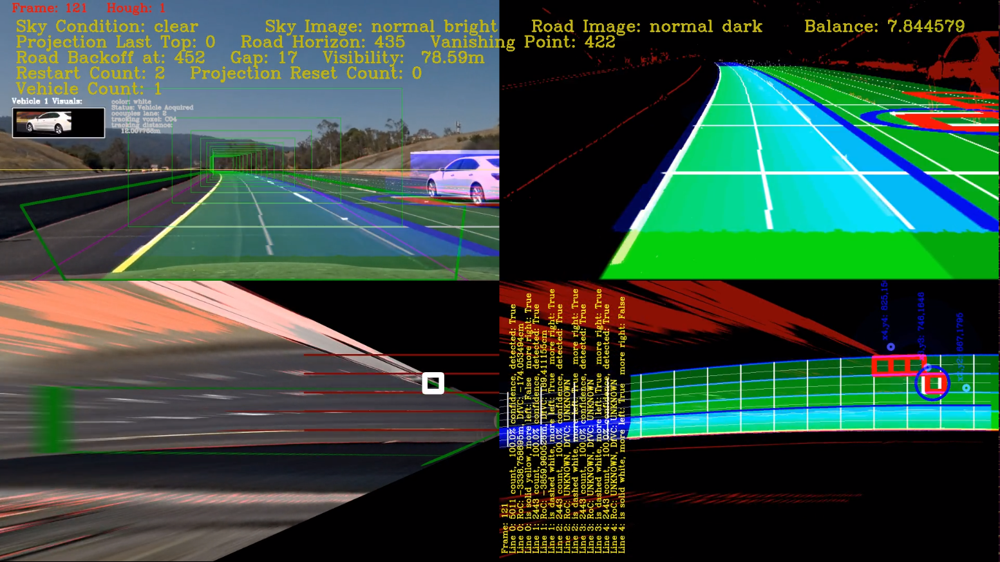

#### 3.3.5 Vehicle Locked

After Vehicle Acquired state, the vehicle goes into 'Vehicle Locked' state where, hopefully it will last the rest of its life cycle.  In this state, the **Vehicle Tracking** class has control and is sliding the Voxel/Sliding window grid to keep track of the vehicle's visual in its center.  We will explain more able this in section 3.4.  The noticable visual in this state is the green border around the vehicle visual and the status 'Vehicle Locked'.


#### 3.3.6 Vehicle Occluded

The vehicle may go into this state when it is being occluded from view by another vehicle going in front of it.  In this state, the **Vehicle Tracking** class will attempt to keep the two vehicles separated and monitor their locations by using the Voxel/Sliding window grid to calculate the vehicles trajectory and its most likely separation frame.  The noticeable visual in this state is the orange border around the vehicle visual and the status 'Vehicle Occluded'.  In this state, the vehicle instance is protected from being dropped by having its confidence base reduced, so it can more easily remain actively tracked.

*NOTE: During times when the pipeline is subjected to rapid warping of the road surface, the* **Vehicle Tracker** *may place an affected vehicle instance into* **Occluded** *state until the disruption is over.*

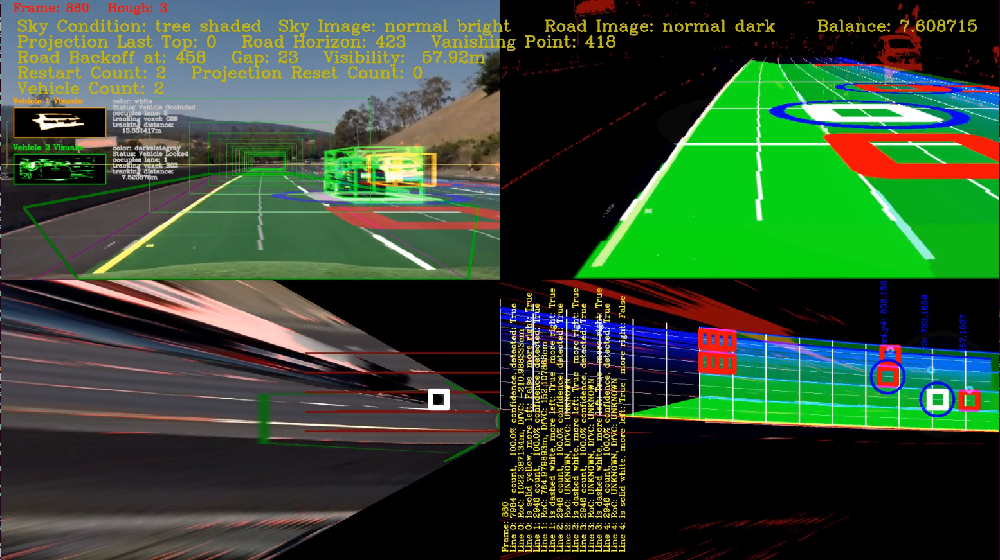

#### 3.3.7 Vehicle Leaving

The vehicle may go into this state when it is leaving the scene by going behind our vehicle or moving beyond our visual range in front.  The vehicle goes to this state whenever the **Vehicle Tracking** class notice that the vehicle appears to be going behind our vehicle in the back, or disappearing from view in the front.  The noticeable visual in this state is the red border around the vehicle visual and the status 'Vehicle Leaving'.

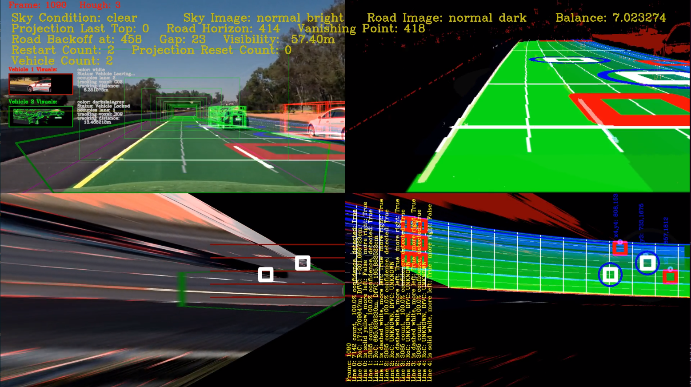

#### 3.3.8 Vehicle Losted

There is no visual for this state, other than the vehicle's visuals will disappear.  The vehicle goes to this state whenever the **Vehicle Tracking** class loses confidence in tracking the vehicle.  More able this in section 3.4.

### 3.4 Vehicle Tracking

As explained earlier, the **Vehicle Tracking** class takes over managing the **Vehicle** class when it goes into *Locked* state.  In this state, the **Vehicle Tracking** class will monitor the vehicle's visual and tries to maintain its visual in the center of the projection.  It does this by using a mask of the vehicle created by using its identified color.  The **Vehicle Tracking** class also takes care of confidence calculations by counting the number of points in the mask it currently was able to find and compare that count with a confidence base that it calculated as an average of points it collected per frame for that vehicle since initialized.  This usually works quite well in tracking the vehicle until we meet with rough road conditions where the road surface may peal away from the plane and the vehicle becomes lost.  Here is an example:

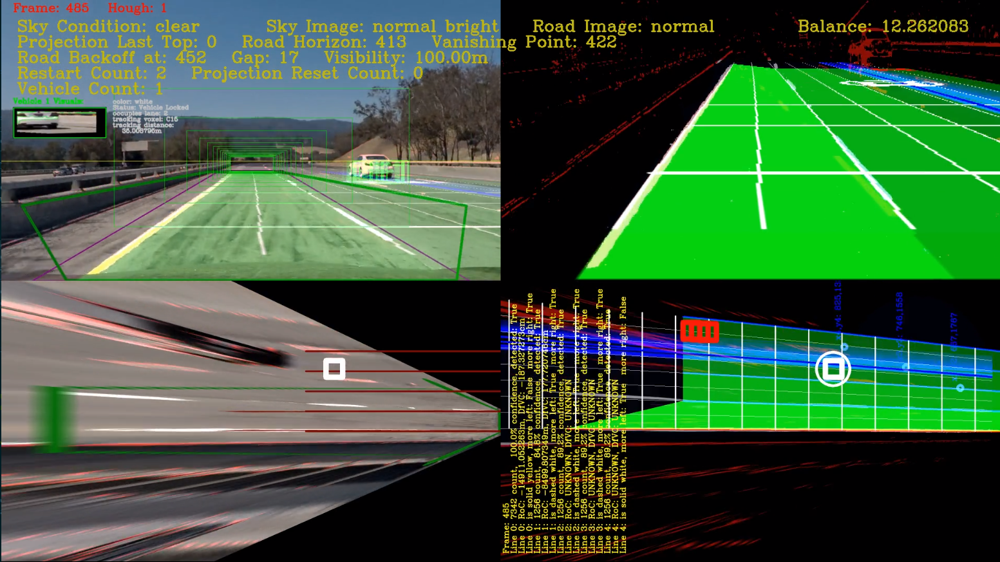

As you can see, the front end of the road way in 'birds-eye' view is beginning to peal away at the front in the image at the lower right corner in **Frame 485**.  And now when the vehicle tracking is disrupted at **Frame 486**.  Notice that the height of the bounding cube is now lower than the vehicle?  Why is that?  What this actually means is that the points near the vanishing point in our perspective view has a higher gradient than from where we are, and so the vertical lines that we are projecting from, where Z=0, is no longer tall enough to reach the tracked vehicle's top.  We will not go into details on how we will compensate for this effect, other than that we are using stabilization to counter it.

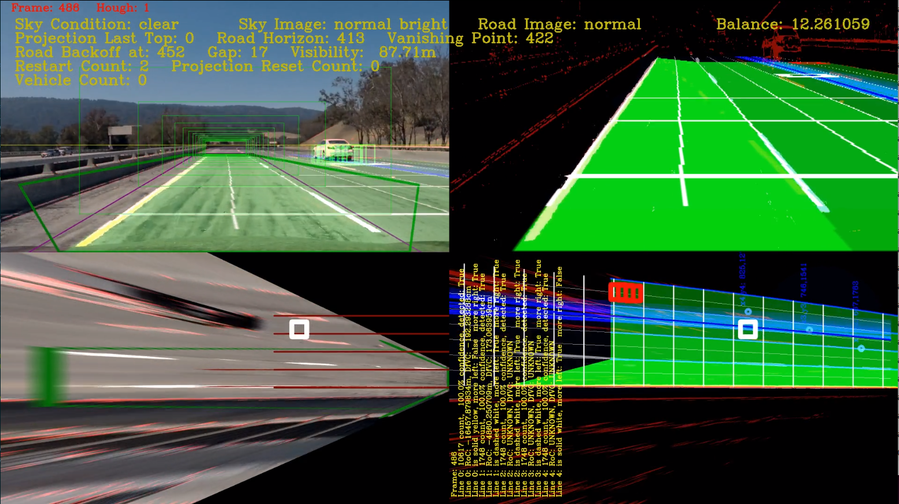

In the case of rough road condition, the **Vehicle Tracking** can force a reprojection of the vehicle with a new height to re-establish visual, or at worst force a rescan of the vehicle in an attempt to find it again.  If neither solution works, then the vehicle is put into a *Vehicle Losted* state and purged from the vehicle list by the **Road Manager**.  In some cases, the vehicle is detected again by the **Vehicle Detection** class and place into service as another vehicle.  But in any case, our pipeline now uses a stabilizing system as can be seen now for the reworked **Frame 486**:

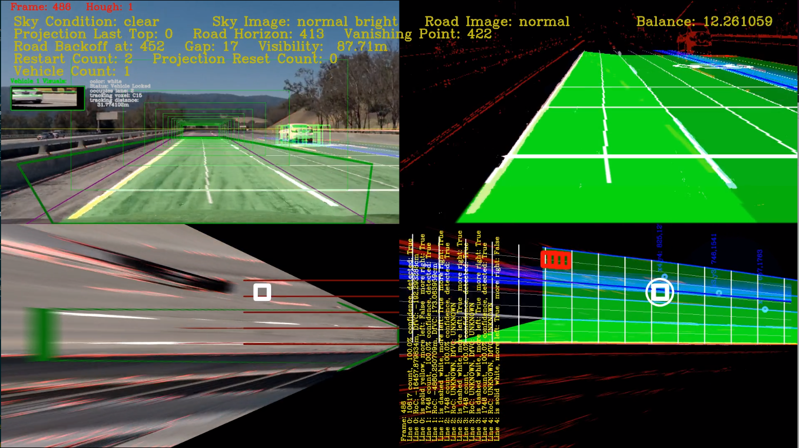

The reason for the ***shakiness*** of the bounding cube should be clear now.  It is because the projection is not stable close to the horizon, so any rapid warping that is occuring there is also rippling through the rest of the road surface and causing the 3D projections to become unstable and shaky.  In other words, the 3D reconstruction quality is just as good as the image quality we are using.  So, with the new stability system, how quickly can we get back to normal tracking?  Believe it or not, as little as 10 frames as can be seen at **Frame 496**.

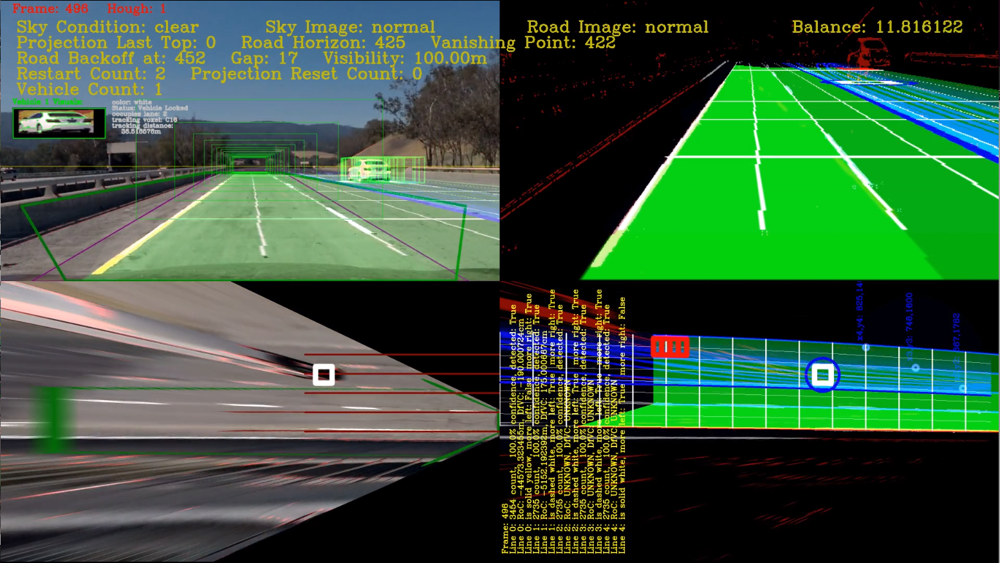

Notice that the image of the vehicle is now properly centered in its vehicle visuals box once again.

Another tracking issue we discovered was that there may actually be too many voxel created on the **Road Grid**.  This causes a ping-pong effect where when a vehicle leaves its previous voxel and moves on to the next.  The previous voxel still wants something in its place and creates a phathom vehicle in its place.  Interesting enough, the fix seems to be to remove the voxels.  We have done this in the bottom half of the **Road Grid**, and it does not seem to cause any harm and makes false-positives less likely too.

### 3.5 Areas where the Pipeline Breaks

As with all software made by humans, this pipeline is not perfect.  There are many things still left to do.  Many are discussed in section 4, so we will not go through them here.  We already discussed the ***shakiness*** issue that is caused by traveling on an uneven road surface in section 3.4.  Also, this pipeline is not generic.  It has a specific goal in mind, to be able to detect and track vehicles in a multi-lane highway using 3D reconstruction techniques.  This pipeline would be less than ideal for detecting and tracking parked vehicles at the side of the road for instance.

#### 3.5.1 Pipeline Assumptions:

1. The detection and tracking environment is a multi-lane highway.
2. Only vehicles in the roadway are counted and only if they are within range.
3. If the lanes are not detected and 3D mapped, then vehicles on those lanes will not be detected nor tracked.
4. This pipeline has problems with detecting vehicles on on-ramps, since they currently cannot be mapped.

#### 3.5.2 Phantom of the Vehicles

False-positives are still an issue with the CHOGRGB4 HOG features used in the SVM linear classifier.  The **Vehicle Tracking** class attempts to reject them as soon as it is able, but there are side effects that cannot be removed unless we delay detection.  Here are some examples of the *Phantoms*:

In this example, the phantom is the scan with no vehicle visual.

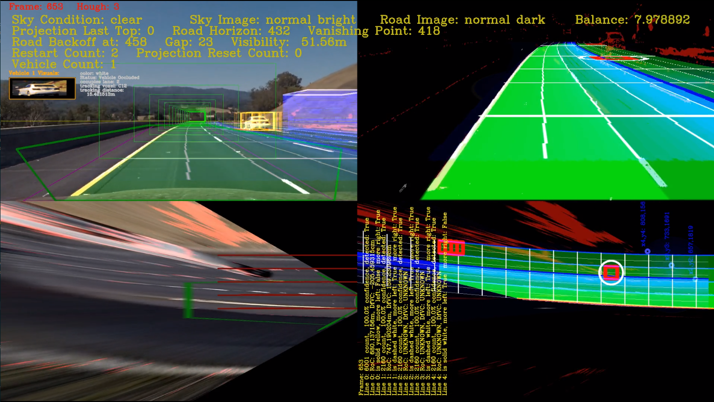

In this example, the phantom here is a vehicle visual but no scan, or bounding cube.

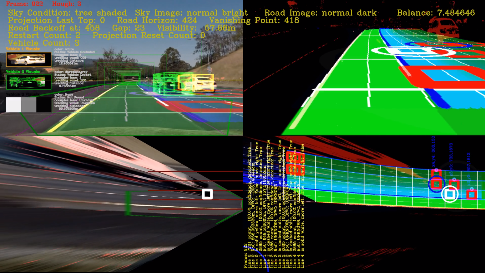


## 4 Areas of Further Studies

As with Project 4, there are numerous topics to study further.  Below are just a few that I could list from the top of my head.

### 4.1 Optimization

This pipeline is by no means optimized.  Areas to explore on optimizations are many, but a quick list of them includes:

1. Update Voxel Implemenation:  This implementation is brute force, and should be rewritten, especially for GPU acceleration.
2. CPU multi-processing:  Use multiple CPUs to process the video in parallel.
3. GPU acceleration:  Use GPU to render 3D scenes and augmentation.

### 4.2 Image Enhancements

This pipeline currently uses 1280x720 sized video images with full HD projection of 1080x1920 (Full HD rotated 90 degrees on its side).  Shaper more detailed rendering, 3D reconstruction and augmentation can be achieved with a full HD 1920x1080 video.  Perticularly if we also project into a 4K image surface with a resolution of 2160x3840 pixels (landscape profile rotated 90 degrees on its side and rendered as portrate).

### 4.3 Applying Different Algorithms for Detection

We are using HOG features with a SVM trained model and sliding windows.  Maybe other ML/NN techiques could be used in conjunction with this pipeline.  We should explored this interesting space.

Another possibility is to use a different training set to identify makes and model of the vehicle detected instead of just naming a color during the scanning state.

### 4.3 Road Surface Point Cloud Generation and Tesselation

Currently we are modeling the surface of the road as a flat plane, which in general works, but does not fully explain the 3D reconstucted scene.  A more robust solution would create point clouds using the deformalities that are projected back into the 'birds-eye' view by the warp function.  The non-uniformity in the images points to a way to extract the 3D point cloud from the model and re-project them back into a 3D space.  If this hypothesis works, then the 3D point clouds created by the projection anomalies can be tesselated into a surface that truely represents the road including its surface gradients.

### 4.4 Voxelization and OpenGL Rendering

Voxelization techiques are used in GPU accelerated 3D graphics rendering.  An example of this is in this paper from NVIDIA: [https://developer.nvidia.com/content/basics-gpu-voxelization](https://developer.nvidia.com/content/basics-gpu-voxelization), where they presented an overview of what Voxelization is and how to use a GPU to render Voxels instead of a rasterized pixel image.  This use case and using OpenGL exceleration, can greatly speed up the vehicle detection model and rendering of the 3D model of the scene.  Real-time processing of this information in better quality is very possible.

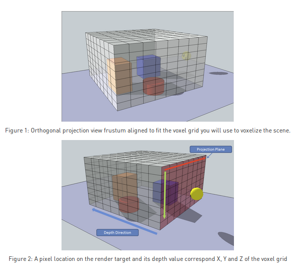

### 4.5 As a Tool for Automated Data Collection and Classification

This pipeline can be modified and used as a way to collect and classify images of vehicles in profile.  As can be seen in the visual profile images during tracking, these images can be copied and stored for later training by ML vehicle detection models by just processing a video of the roadway.

### 4.6 As a Tool for Re-Enforcement Learning to Train Steering Models

Another use case for this pipeline is as a re-enforcement learning trainer for a agent that trains DNN models for steering.  Steering angles can be generated by the curvature of the road as computed by the newer **Projection Manager** to a greater accuracy.  It may be possible to use it in an environment such as the *Udacity SDC Simulator* and along with a scaffolding like the [Agile Trainer](https://github.com/diyjac/AgileTrainer) be able to generate models and have this pipeline train the model automatically without human intervention.

### 4.7 Enhancements

Additional enhancements that could improve this vehicle detection and tracking proof-of-concept is to add speed monitoring of both our vehicle and the others by counting the lane line segments and gaps (12 meters per segment and gap) and calculate the speed of travel.  We can calculate the speed of the other vehicles by adding their relative speed difference to our calculated speed for our own vehicle to come up with a total.

### 4.8 In Conclusion

This has been a great project.  We are sorry to see it end, but we need move on to Term 2!  Cheers!


