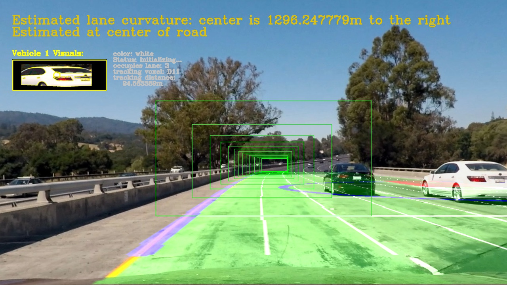
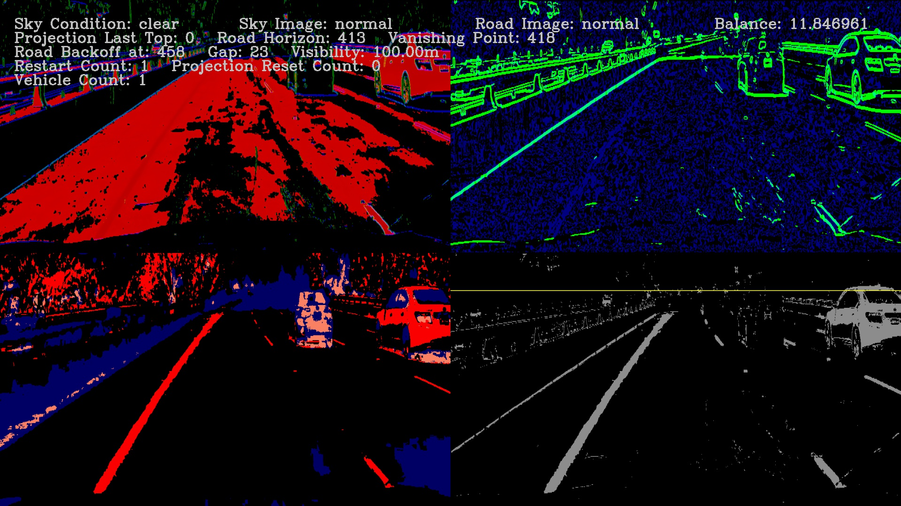
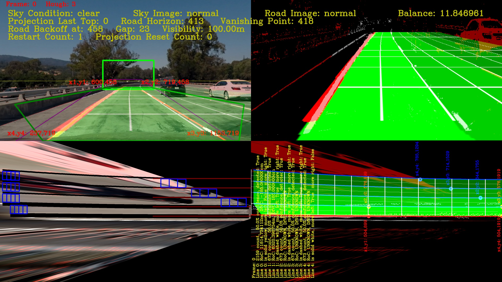
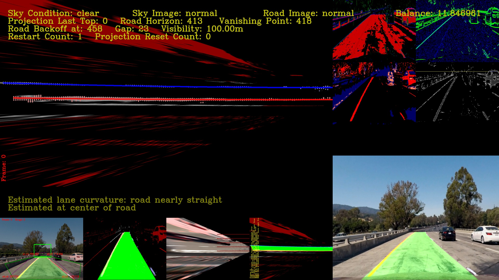

SDC-P5
======
Udacity Self-Driving Car Project 5: Vehicle Detection and Tracking


Use Histogram of Oriented Gradients (HOG) feature extraction on a set of labeled vehicle and non-vehicle images to train a classifier to detect vehicles in a video.

SDC-P5 is a command line interface (CLI) software written in python that is structured internally as a software pipeline, a series of software components, connected together in a sequence or multiple sequences (stages), where the output of one component is the input of the next one.  The majority of its software is based on the Open Source Computer Vision Library (OpenCV).  OpenCV is an open source computer vision and machine learning software library. OpenCV was built to provide a common infrastructure for computer vision applications and to accelerate the use of machine perception in the commercial products.  More about OpenCV can be found at http://opencv.org/.  More details about this pipeline implementation can be found [here](./README-PROJECT-DETAILS.md)

## Installation

This project uses python 3.5.2.  Clone the GitHub repository, and use Udacity [CarND-Term1-Starter-Kit](https://github.com/udacity/CarND-Term1-Starter-Kit) to get the rest of the dependencies.

```
$ get clone https://github.com/diyjac/SDC-P5.git
```

## Usage

As explained earlier, SDC-P5 is a python based CLI.  You list options by using `--help`:

```
$ python P5pipeline.py --help
usage: python P4pipeline.py [options] infilename outfilename

DIYJACs Udacity SDC Project 5: Vehicle Detection and Tracking

positional arguments:
  infilename   input image or video file to process
  outfilename  output image or video file

optional arguments:
  -h, --help   show this help message and exit
  --diag DIAG  display diagnostics: [0=off], 1=filter, 2=proj 3=full
               4=projHD,complete 5=projHD,sentinal
  --notext     do not render text overlay
  --collect    collect 64x64 birds-eye view images for HOG training
```

To process an image or a video using this pipeline, use this format:

```
$ python P5pipeline.py <inputfile> <outputfile>
```

The following is an example run:

```
$ python P5pipeline.py test_images/test1.jpg output_images/test1.jpg
```

And produces this output:



You may also wish to use the diagnostics mode and see how the pipeline process the images internally.  The following `--diag=1` option turns on image filter diagnostics:

```
$ python P5pipeline.py --diag=1 test_images/test1.jpg output_images/test1diag1.jpg
```

will produce this image:



Use the `--diag=2` option to invoke the **ProjectionManager** diagnostics as shown here:

```
$ python P5pipeline.py --diag=2 test_images/test1.jpg output_images/test1diag2.jpg
```

will produce this image:



Use the `--diag=3` option to invoke the **Full Diagnotics Mode** as shown here:

```
$ python P5pipeline.py --diag=3 test_images/test1.jpg output_images/test1diag3.jpg
```

will produce this image:



The `--diag=4`, `--diag=5` and `--collect` options are for data collections and were used for collect a new 'birds-eye' view dataset for HOG feature training.

## Contributing

No further updates nor contributions are requested.  This project is static.  However, if enough people are interested in continuing with this project and areas of further studies, we will create a live repository where contributions will be welcome.  In any case, feel free to fork this repository for your own exploration.  Have fun!

## License

SDC-P5 results are released under [MIT License](./LICENSE)

## Have fun!

Feel free to fork this repository and make a different version! This tool is only as good as it fits your needs, so modify it!