# Failed Lab Attempts

This is a log of our failed HOG feature attempt using Udacity's data.  We eventually gave up on using the perspective images for vehicle detection in 'birds-eye' view, but are keeping this log for future reference.

## 2 Histogram of Oriented Gradients (HOG)

In this section we will explain how we extracted HOG features from a vehicle/non-vehicle dataset and used them to train a linear classifier to detect vehicles in an image.

### 2.1 Vehicle Lab

Our Vehicle detection dataset analysis, training, and testing were done in the [vehicleLab](./vehicleLab/attempts) directory where you can find the old training and testing scripts and libraries, stored trained models, test images and resulting visualizations.  There is a `runtraining.sh` script to execute the complete training in this directory, with the results of the training captured in the [./vehicleLab/attempts/trainingLog.txt](./vehicleLab/attempts/trainingLog.txt) log file.  We will discuss our findings in the rest of section 2.

### 2.2 HOG Training Dataset

We started out with a set of vehicle and non-vehicle images obtained from [GTI vehicle image database](http://www.gti.ssr.upm.es/data/Vehicle_database.html), the [KITTI vision benchmark suite](http://www.cvlibs.net/datasets/kitti/), and examples extracted from the project video itself.  We use the following code segment to read and process the path to the images:

```
# Divide up into cars and notcars
cars = glob.glob('../vehicles/*/*.png')
notcars = glob.glob('../non-vehicles/*/*.png')

print("number of original car samples: ", len(cars))
print("number of original non-car samples: ", len(notcars))
```

and then read them in as images as part of the extract_features() function as shown in the following code segment:

```
# Define a function to extract features from a list of images
# Have this function call bin_spatial() and color_hist()
def extract_features(imgs, cspace='RGB', spatial_size=(32, 32),
                        hist_bins=32, hist_range=(0, 256), orient=9,
                        pix_per_cell=8, cell_per_block=2, hog_channel=0,
                        datatype='', visualize=False):
    features = []
    # Iterate through the list of images
    images_pbar = tqdm(range(len(imgs)), desc='Loading '+datatype+' Dataset', unit=' features')
    for i in images_pbar:
        file = imgs[i]
        # Read in each one by one
        image = cv2.cvtColor(cv2.imread(file), cv2.COLOR_BGR2RGB)

```

We will show some examples of these datasets in later subsections.  One thing to note is that in the `non-vehicles/Extras` dataset, we discovered some vehicle images mistakenly included.  Some examples include:

  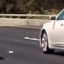        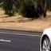      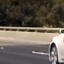

We have removed all that we could find from the `non-vhicles/Extras` dataset and moved them [here](./Mislabeled) for later analysis.

### 2.3 HOG Feature Set Exploration

Once we read in the vehicle and non-vehicle dataset, we explored different HOG features that we could extract and test.  After each run, the result of the model was saved as well as its scaled_X transform with `scikit-learn` `joblib.dump()` function.  We will use the best saved model for our final vehicle detection implementation in our pipeline.  The following table shows the HOG features we explored:

| HOG Name | Color Space | HOG Channel | Orientation | Pixel/Cell | Cell/Block | Jittered | Train Accuracy | Test Accuracy | Prediction Time |
| :---: | :---: | :---: | :---: | :---: | :---: | :---: | :---: | :---: | :---: |
| CHOGRGB1 | RGB | 0 | 9 | 8 | 2 | No | 1.000 | *0.986199282* | 0.00007152 secs |
| CHOGRGB2 | RGB | 0 | 8 | 4 | 2 | No | 1.000 | 0.976262766 | 0.00007677 secs |
| CHOGRGB3 | RGB | 0 | 9 | 8 | 2 | Yes | 0.96772 | 0.9461777201 | 0.00007534 secs
| CHOGRGB4 | RGB | 0 | 8 | 4 | 2 | Yes | 0.9999 | 0.947833287 | 0.00009870 secs |
| CHOGHSV1 | HSV | 1 | 9 | 8 | 2 | No | 1.000 | 0.980402981 | 0.00007033 secs |
| CHOGLUV1 | LUV | 1 | 9 | 8 | 2 | No | 1.000 | 0.975158708 | 0.00007224 secs |
| CHOGHLS1 | HLS | 2 | 9 | 8 | 2 | No | 1.000 | 0.969638421 | 0.00007057 secs |
| CHOGYUV1 | YUV | 0 | 9 | 8 | 2 | No | 1.000 | 0.985647254 | **0.00006818 secs** |
| CHOGYUV2 | YUV | 0 | 9 | 4 | 2 | No | 1.000 | **0.986751311** | 0.00007700 secs |
| CHOGGRAY1 | Grayscale | Grayscale | 9 | 8 | 2 | No | 1.000 | 0.956389732 | 0.00007843 secs |
| CHOGGRAYRGB1 | Both Grayscale and RGB | Grayscale | 9 | 4 | 2 | No | 1.000 | 0.9862611096 | 0.00017189 secs |
| CHOGRGB5 | RGB | 0 | 9 | 2 | 2 | Yes | 1.000 | 0.916643665 | 0.000083746 secs |
| CHOGHLS2 | HLS | 2 | 9 | 4 | 2 | No | 1.000 | 0.966602263 | 0.000078678 secs |

We then applied the binned color features and the histograms of color in the color space to the HOG feature vector, except for the CHOGGRAY1, which only has the Histogram of Oriented Gradients vectors.  After forming the feature vector, it is then normalized using the `Sci-Kit Learn` `StandardScaler` function to normalize the vector before training with the SVM linear classifier.

The HOG feature set for CHOGYUV2 seems to have the best accuracy, 0.98675; follow closely by CHOGHLS2 with 0.96660 accuracy.  CHOGYUV1 had the best timing with just 0.00006818 seconds to do a prediction, but with a lower accuracy of 0.98564.  The following subsections will show 13 HOG features we explored briefly.

#### 2.3.1 CHOGRGB1 HOG Features

We first explored the RGB color space with Red (0) as the primary HOG channel.  Since we already show all the results in the table in section 2.3, we will just show what the feature from the `skimage.hog()` output looks like.  The code that train this HOG feature is [chogtrainingRGB1.py](./chogtrainingRGB1.py)


#### 2.3.2 CHOGRGB2 HOG Features

We continue to explored the RGB color space with Red (0) as the primary HOG channel, but with different orientation, pixel/cell and cell/block combinations.  Since we already show all the results in the table in section 2.3, we will just show what the feature from the `skimage.hog()` output looks like.  It appears that increasing the resolution of the HOG features actually lowered its accuracy.  The code that train this HOG feature is [chogtrainingRGB2.py](./chogtrainingRGB2.py)


#### 2.3.3 CHOGRGB3 HOG Features

We continue to explored the RGB color space with Red (0) as the primary HOG channel with the same orientation, pixel/cell and cell/block combinations as CHOGRGB1, but with a subset of jitter patterned used for Project 2.  Since we already show all the results in the table in section 2.3, we will just show what the feature from the `skimage.hog()` output looks like.  It appears that jittering input to the HOG features actually lowered its accuracy.  The code that train this HOG feature is [chogtrainingRGB3.py](./chogtrainingRGB3.py)

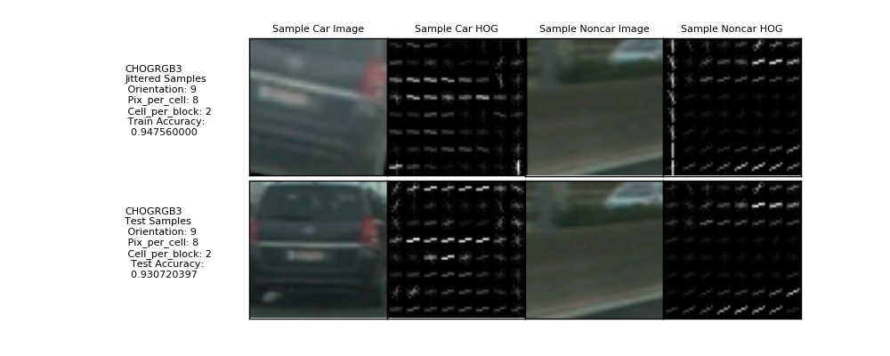

#### 2.3.4 CHOGRGB4 HOG Features

We continue to explored the RGB color space with Red (0) as the primary HOG channel with the same orientation, pixel/cell and cell/block combinations as CHOGRGB2, but with a subset of jitter patterned used for Project 2.  Since we already show all the results in the table in section 2.3, we will just show what the feature from the `skimage.hog()` output looks like.  Again, it appears that jittering input to the HOG features actually lowered its accuracy.  This time lowering training accuracy also.  The code that train this HOG feature is [chogtrainingRGB4.py](./chogtrainingRGB4.py)

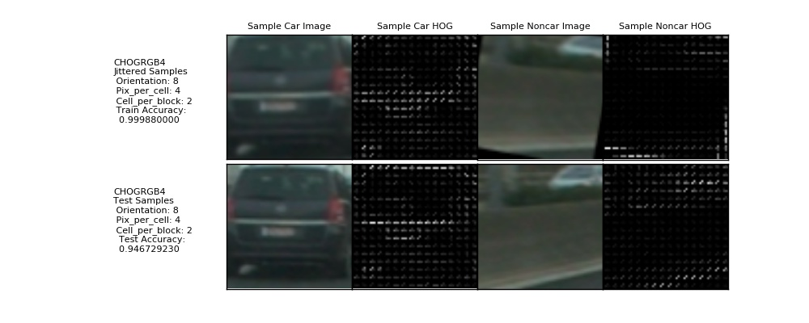

#### 2.3.5 CHOGHSV1 HOG Features

We continue to explored the HSV color space with Saturation (1) as the primary HOG channel with the same orientation, pixel/cell and cell/block combinations as CHOGRGB1.  Since we already show all the results in the table in section 2.3, we will just show what the feature from the `skimage.hog()` output looks like.  We find similar results as CHOGRGB1 with higher accuracy for CHOGRGB1.  The code that train this HOG feature is [chogtrainingHSV.py](./chogtrainingHSV.py)

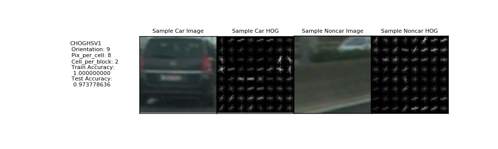

#### 2.3.6 CHOGLUV1 HOG Features

We continue to explored the HSV color space with U (1) as the primary HOG channel with the same orientation, pixel/cell and cell/block combinations as CHOGRGB1.  Since we already show all the results in the table in section 2.3, we will just show what the feature from the `skimage.hog()` output looks like.  We find lower results than the rest of the HOG features.  The code that train this HOG feature is [chogtrainingLUV.py](./chogtrainingLUV.py)


#### 2.3.7 CHOGHLS1 HOG Features

We continue to explored the HLS color space with Saturation (2) as the primary HOG channel with the same orientation, pixel/cell and cell/block combinations as CHOGRGB1.  Since we already show all the results in the table in section 2.3, we will just show what the feature from the `skimage.hog()` output looks like.  We find lower results than the rest of the HOG features.  The code that train this HOG feature is [chogtrainingHLS1.py](./chogtrainingHLS1.py)


#### 2.3.8 CHOGYUV1 HOG Features

We continue to explored the YUV color space with Y (Luma - 0) as the primary HOG channel with the same orientation, pixel/cell and cell/block combinations as CHOGRGB1.  Since we already show all the results in the table in section 2.3, we will just show what the feature from the `skimage.hog()` output looks like.  We find a result similar to CHOGRGB1.  The code that train this HOG feature is [chogtrainingYUV1.py](./chogtrainingYUV1.py)


#### 2.3.9 CHOGYUV2 HOG Features

We continue to explored the YUV color space with Y (Luma - 0) as the primary HOG channel with the same orientation, pixel/cell and cell/block combinations as CHOGRGB2.  Since we already show all the results in the table in section 2.3, we will just show what the feature from the `skimage.hog()` output looks like.  This time, we find an accuracy result higher than CHOGRGB1.  The code that train this HOG feature is [chogtrainingYUV2.py](./chogtrainingYUV2.py)


#### 2.3.10 CHOGGRAY1 HOG Features

We continue to explored but now using Grayscale as the primary HOG channel with the same orientation, pixel/cell and cell/block combinations as CHOGRGB1.  Since we already show all the results in the table in section 2.3, we will just show what the feature from the `skimage.hog()` output looks like.  This time, we find an accuracy result one of the lowest thus far.  The code that train this HOG feature is [chogtrainingGray1.py](./chogtrainingGray1.py)


#### 2.3.11 CHOGGRAYRGB1 HOG Features

We continue to explored but now using Grayscale as the primary HOG channel with added RGB color histograms and the same orientation, pixel/cell and cell/block combinations as CHOGRGB2.  Since we already show all the results in the table in section 2.3, we will just show what the feature from the `skimage.hog()` output looks like.  This time, we find an accuracy result one of the highest thus far, but also with the highest prediction time of 0.00017189 seconds.  The code that train this HOG feature is [chogtrainingGrayRGB.py](./chogtrainingGrayRGB.py)

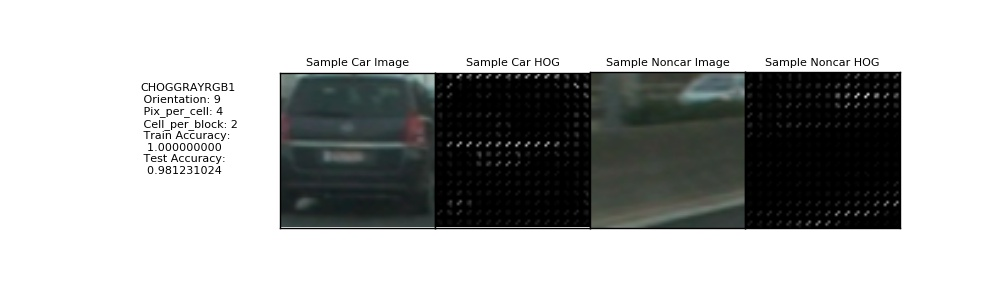

#### 2.3.12 CHOGRGB5 HOG Features

We continue to explored RGB color space with Red (0) as the primary HOG channel with a jitter combination and a new orientation, pixel/cell and cell/block combinations.  Since we already show all the results in the table in section 2.3, we will just show what the feature from the `skimage.hog()` output looks like.  This time, we find the lowest accuracy result, so jittering and increasing resolution does not seem like a good combination for training HOG features in a Linear SVM classifier.  The code that train this HOG feature is [chogtrainingRGB5.py](./chogtrainingRGB5.py)

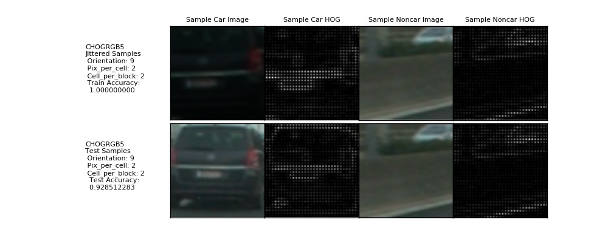

#### 2.3.13 CHOGHLS2 HOG Features

This is the last HOG feature set we will explore.  It is based on the HLS color space with Saturation (2) as the primary HOG channel with a jitter combination and a new orientation, pixel/cell and cell/block combinations.  Since we already show all the results in the table in section 2.3, we will just show what the feature from the `skimage.hog()` output looks like.  This time, we find a lower accuracy result.  The code that train this HOG feature is [chogtrainingHLS2.py](./chogtrainingHLS2.py)


### 2.3.14 HOG Final Feature Selection

At the end of this exploration, we wanted to decide on either **CHOGYUV2** or **CHOGYUV1** HOG features.  One gave us the highest test accuracy while the other gave us the fastest prediction time.  However, we will delay this decision because we want to see how well they perform in a sliding window search.

### 2.4  Sliding Windows Search

To implement a sliding window search, we need to decide what size window we want to search, where in the image we want to start and stop our search, and how much we want windows to overlap.  On top of that any size window patch we want to make bigger than the 64x64 image samples we use to train our HOG feature Linear SVM classifier on would have to be resized, a time and CPU resource intensive task.  We decided to start with a 128x128 and 64x64 sets of 50% overlapping between windows in both vertical and horizontal dimensions.  This was our initial sliding window pattern:


This produced searches that had a lot of fault positives, and were too time consuming.  Took as much as a second per screen without even putting in effort to get rid of fault positives.  It was not very satisfying.


We could have removed all of the windows on the left to reduce our fault positives and, at the same time, reduce our time spent to almost half, but that seem just going half way, and we do not gain additional features either.  On the whole, not satisfying either.

We decided to look at our previous **Project 4, Advanced Lane Finding** and previous lessons for inspiration.  And thought of if only we could deploy a similar trick that Support Vector Machines (SVM) uses: the **Kernel Trick.**  The **Kernel Trick** makes a problem that is hard to solve linearly by transforming the problem space to a higher dimension to make it linear.  The following picture explains the idea well:


Consider you are trying to separate the data points represented by the red dots from the blue dots on the left chart.  How can we do using a linear separator?  The answer is to project the points to a higher 3 dimensional space and then separate them there with a plane as depected on the right.  Here is an exellent article about this here: [http://www.eric-kim.net/eric-kim-net/posts/1/kernel_trick.html](http://www.eric-kim.net/eric-kim-net/posts/1/kernel_trick.html).

So, what have we learned from previous projects and lesson that can help?  Then the idea of the unwarping from perspective to birds-eye view came to mind and why that was necessary for measuring the curvature of the road.  If only we could use that somehow.  Part of the problem is that even if we could do this, the birds-eye view's resolution was not good enough.  We have too much noise in the image to do the sliding window detection.  But it was something to think about, so why not give it a try?

### 2.5 Birds-eye View as a Kernel Trick

The first problem to solve is the resolution.  How do we increase the resolution of the 'birds-eye' view?  Recall this was the best we could do for **Project 4: Advanced Lane Finding**:


While it is pretty good, as you may notice, the width of the lanes are just 36 pixels wide.  May not be a good enough resolution with what we have in mind.  So, if we keep projecting the perspective image to the same 1280x720 resolution image, then nothing will change.  Can we project the 'birds-eye' view to a higher resolution image?  The answer turn out to be *Yes*!  Most of the example given in OpenCV on doing the `OpenCV` `cv2.warpPerspective()` function warps the projection back to the same size image; however, if you look at the documentation [here](http://docs.opencv.org/2.4/modules/imgproc/doc/geometric_transformations.html).  There is nothing in the document that saids the destination has to be the same size image, so why not use a Full HD size resolution?  Our first attempt was this:


Which is not bad.  Our pixel between the lane lines just got a lot better at around 54 pixels apart.  But if only we could project deeper into the horizon.  As it turns out, we can!  There is nothing that says we need to keep the wider part of the image at 1920 pixel horizontal.  Why not rotate it 90 degrees and make it a verticle axis so we can look deeper into the horizon?  Here is the result:


Wow!  The lane lines on the other lanes are clearly visible now.  Can we find those lanes as well?  As it turns out, we can!  Here are some results we can now achieve with this resolution (Solid White):


The algorithm could not look past the 4th lane line and see the additional 2 beyond them in the following image (Solid Yellow):


Now our lane lines are a little more than 64 pixels apart.  Good enough for our classifier to run without having to resize!  Yeah!  Now we have to decide how to place our sliding windows in 'birds-eye' view.

### 2.6 Birds-eye View as a Sliding Window Canvas

One of the problems with perspective images, is that things far away may have different sizes and even shapes when view near or far away.  The sliding windows with multiple sizes and overlaps were made to solve this problem.  But other problems come up because our sliding window may look at trees and concrete dividers and decides those are vehicles too.  Now that we created a **Kernel Trick** and projected the perspective image plane into a higher 3rd dimension and then reprojected down to a 'birds-eye' view, did we gain linear separability?  The answer is *Yes* because its like the **SVM** **Kernel Trick**, our 'birds-eye' view is the linear separator!  We no longer have to worry about trees or the sky in the image because they would never get projected into a 'birds-eye' view!  With the 'birds-eye' view, we can clearly see the lane division and, at the same time, we notice what belongs in those lanes, *other vehicles* we need to **detect** and **track**!  So, we still do not not have a good idea if our new sliding window canvas can be used to detect vehicles by our trained linear classifier, nor where to place those sliding windows.  The answer, it turns out, is that we just need those detectors on the lanes because once we detect them, they will be easy to track on the 'birds-eye' view.  There is nowhere for them to disappear to because they are the same size and shape when projected to a plane.  Here is a view where we lay down a wire frame to the lane surface to get a good idea of how uniform the surface is:


They are clear mapped correctly, but so, how do we calculate where those sliding windows belong?  While we were testing the uniformity of the surface, we were playing with the polynomials that made up the lane lines.  As it turns out, we could interpolate and do calculations on them too and can find the location of the lanes and get their centers.  Recall we now have a shared array of lines that are managed by an array of lane classes?  Here is how we use them in the code to decide where to search for vehicles in the 'birds-eye' view:

```
    # specialized sliding window generation.
    # we are looking at top down birds-eye view and limiting the detection to just the lanes.
    # we need to use the lane lines to help generate the sliding window locations.
    def slidingWindows(self, lines, complete=False):
        # initial empty window list
        window_list = []

        # calculate the window positions
        nlanes = len(lines)-1
        for i in range(nlanes):
            leftPolynomial = np.poly1d(lines[i].currentFit)
            rightPolynomial = np.poly1d(lines[i+1].currentFit)

            # horizontal lines
            if complete:
                print("bottomProjectedY for ", i, int(lines[i].bottomProjectedY/32))
                for j in range(int(lines[i].bottomProjectedY/32)):
                    y1 = 32*j
                    mid = int((rightPolynomial([y1])+leftPolynomial([y1]))/2)
                    x1 = mid-32
                    x2 = mid+32
                    y2 = y1+64
                    window_list.append(((x1,y1),(x2,y2)))
            else:
                linetop = lines[i].getTopPoint()
                if i == 0:
                    ylist = [ linetop[1], linetop[1]+32, linetop[1]+64]
                else:
                    ylist = [ linetop[1], linetop[1]+32, linetop[1]+64, lines[i+1].bottomProjectedY-64, lines[i+1].bottomProjectedY, lines[i+1].bottomProjectedY+64]
                for y1 in ylist:
                    mid = int((rightPolynomial([y1])+leftPolynomial([y1]))/2)
                    x1 = mid-32
                    x2 = mid+32
                    y2 = y1+64
                    window_list.append(((x1,y1),(x2,y2)))
        return window_list
```

You will notice that there is a `complete` flag in the parameter to the slidingWindows function.  This is so that in the an image or in the early stages of a video, we need to do a complete scan of the lanes to detect all of the vehicles.  However, later in a video, we don't have to be so aggressive in our search, since vehicles already found are now tracked.  We just need to detect new vehicles entering into our scanning area.  So, just the top or the bottom of the lanes!  Here is something to help you with the idea.  This is where all of the sliding windows are when we do a full scan of the trackable area as calculated by the algorithm above:

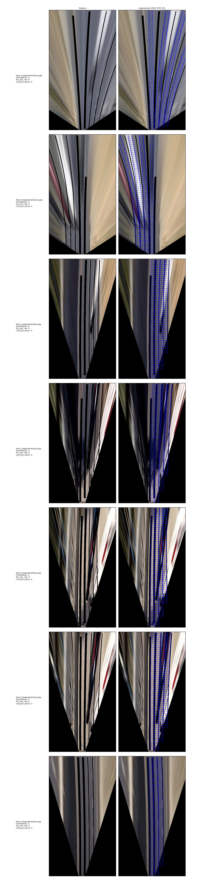

And this is what it looks like when we do a *sentinal* scan:


A lot fewer sliding windows to manage and search per frame.  So, how well does it work?  Let's test it out in the next section.

*NOTE: You may notice that the lane lines are masked out and removed.  Since we already know where the lane lines are, this is to keep the vehicle detector from using them to find false positives.*

### 2.7 Sliding Windows on 'Birds-eye' View Canvas Results

Recall our results from our earlier tests, we expected the CHOGYUV2 to be the best detector of vehicles out of our 13 trained HOG features set; however, as we will soon see, this is not the case for us in this new approach.  The next set of subsections describes the results of using the Linear SVM classifiers with sliding windows on our new higher resolution 'Birds-eye' view canvas.

#### 2.7.1 CHOGRGB1 HOG Features Sliding Window Test Results

This HOG Feature is actually good at detecting vehicles in the test22 (Solid White) image, but fails everywhere else.  One good attributes this HOG feature is it will not give false positives, but not detecting vehicles will not do.  So we will pass on this HOG feature for the next phase.


#### 2.7.2 CHOGRGB2 HOG Features Sliding Window Test Results

This HOG Feature performed better than CHOGRGB1, and was able to find vehicles in test1, test3, test4, test5 and test23 images as well.  Unlike the CHOGRGB1, it gives false positives in the test2 image, but it is just a single error and once it is in Sentinal mode, should be fine.  Approved for next phase of investigation.


#### 2.7.3 CHOGRGB3 HOG Features Sliding Window Test Results

This HOG Feature did not perform as well as CHOGRGB2 and has more problems with false positives, but we will allow it to continue to the next phase as a second candidate.  Approved for next phase of investigation.

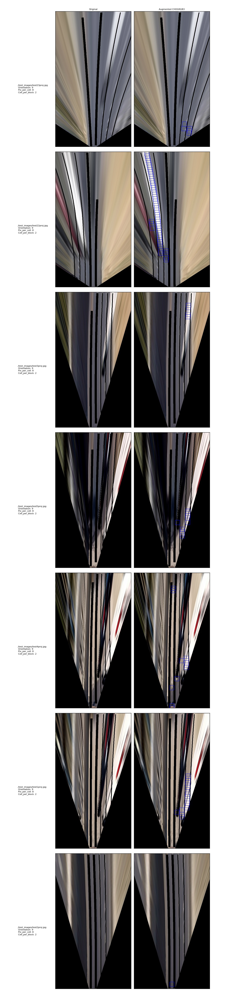

#### 2.7.4 CHOGRGB4 HOG Features Sliding Window Test Results

This HOG Feature has difficulties with false positives and is not recommended for deployment.

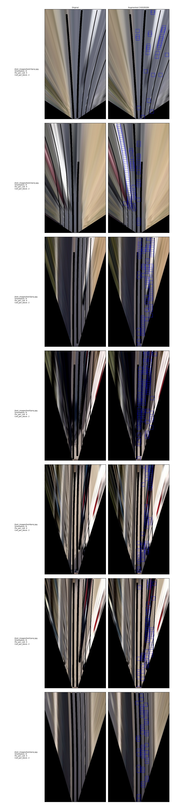

#### 2.7.5 CHOGHSV1 HOG Features Sliding Window Test Results

This HOG Feature did not do as well as CHOGRGB2.  Although it did well with test22 image, it had too many false positive with the rest of the test images, and is therefore not recommended for next phase of investigation.


#### 2.7.6 CHOGLUV1 HOG Features Sliding Window Test Results

This HOG Feature behaved almost the same as CHOGHSV1 except slightly worst.  Although it did well with test22 image, it had too many false positive with the rest of the test images, and is therefore disqualified also from further investigation.

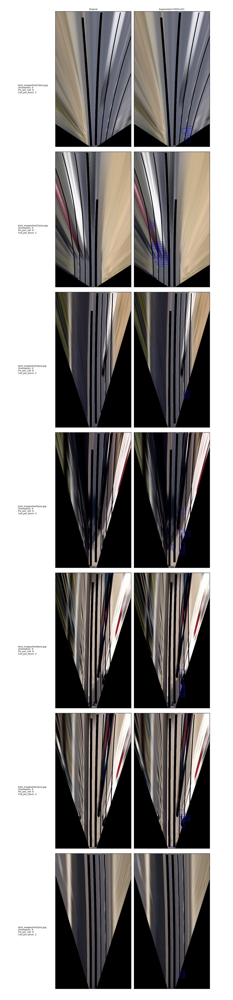

#### 2.7.7 CHOGHLS1 HOG Features Sliding Window Test Results

This HOG Feature hardly detected any vehicles in the 'birds-eye' view, so is not recommended for continuing to the next step.

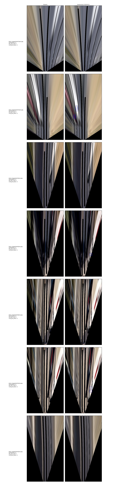

#### 2.7.8 CHOGYUV1 HOG Features Sliding Window Test Results

We expected great things from this HOG feature, but it seems to see vehicles on every surface of the 'birds-eye' view, and is therefore, not recommended for the next phase of the investigation.

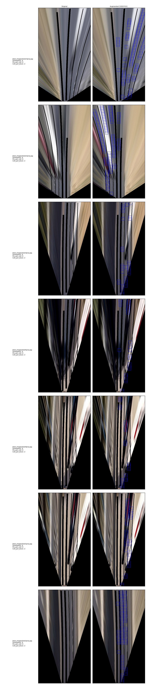

#### 2.7.9 CHOGYUV2 HOG Features Sliding Window Test Results

The result of this HOG feature is similar to CHOGYUV1, and is therefore, not recommended for the next phase of investigation.

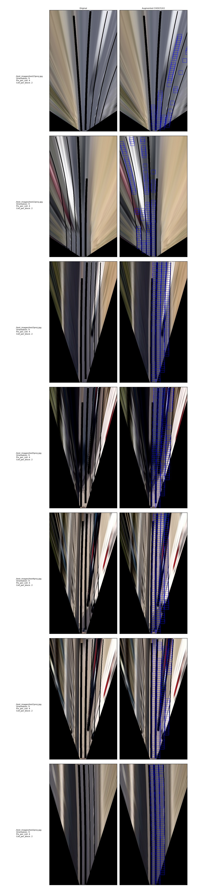

#### 2.7.10 CHOGGRAY1 HOG Features Sliding Window Test Results

This HOG feature resulted in less false positive than the HOGs using YUV color space, however, there are just too many false positive to continue, so we will not recommend it for the next phase.


#### 2.7.11 CHOGGRAYRGB1 HOG Features Sliding Window Test Results

This HOG feature was about the same as CHOGHLS1 and hardly detected any vehicles especially the black colored car.  We do not recommend it for the next phase.


#### 2.7.12 CHOGRGB5 HOG Features Sliding Window Test Results

Althought this car has a lot of fause positives in the static views, it did pickup most of the vehicles, and in particular, it was able to reliably detect no vehicles in the test2 image.  Recommended as candidate 3 for the next phase of investigation.

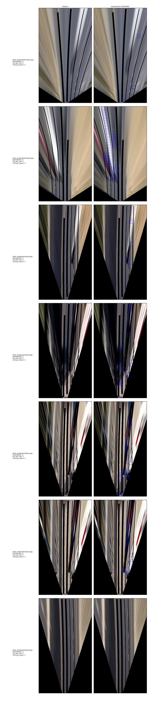

#### 2.7.13 CHOGHLS2 HOG Features Sliding Window Test Results

This HOG feature is like that of CHOGHLS1 and did not seem to be able to detect vehicles even when they are present, so we do not recommend it for the next phase.

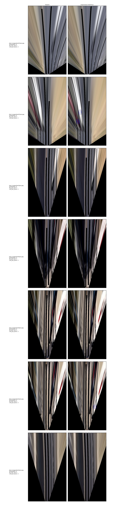

#### 2.7.14 Recommendation for Video Testing

It is interesting that even though **CHOGRGB2**, **CHOGRGB3** and **CHOGRGB5** all scored relatively low in test accuracy compared to the rest of the HOG features trained to detect vehicles, they performed the best during the sliding window testing with the 'birds-eye' view canvas.  Just goes to show you need to keep an open mind when investigating!

We know we could look at hard negative mining and extract the images in the birds-eye view to use for further training.  But we wanted to see if we could use a HOG feature from a perspective image plane against a 'birds-eye' view plane and still get reliable detections.  We believe this is worth investigating.

| HOG Name | Next Phase? | Color Space | HOG Channel | Orientation | Pixel/Cell | Cell/Block | Jittered | Train Accuracy | Test Accuracy | Prediction Time |
| :---: | :---: | :---: | :---: | :---: | :---: | :---: | :---: | :---: | :---: | :---: |
| CHOGRGB1 | *No* | RGB | 0 | 9 | 8 | 2 | No | 1.000 | *0.986199282* | 0.00007152 secs |
| CHOGRGB2 | **Candidate 1** | RGB | 0 | 8 | 4 | 2 | No | 1.000 | 0.976262766 | 0.00007677 secs |
| CHOGRGB3 | **Candidate 2** | RGB | 0 | 9 | 8 | 2 | Yes | 0.96772 | 0.9461777201 | 0.00007534 secs
| CHOGRGB4 | *No* | RGB | 0 | 8 | 4 | 2 | Yes | 0.9999 | 0.947833287 | 0.00009870 secs |
| CHOGHSV1 | *No* | HSV | 1 | 9 | 8 | 2 | No | 1.000 | 0.980402981 | 0.00007033 secs |
| CHOGLUV1 | *No* | LUV | 1 | 9 | 8 | 2 | No | 1.000 | 0.975158708 | 0.00007224 secs |
| CHOGHLS1 | *No* | HLS | 2 | 9 | 8 | 2 | No | 1.000 | 0.969638421 | 0.00007057 secs |
| CHOGYUV1 | *No* | YUV | 0 | 9 | 8 | 2 | No | 1.000 | 0.985647254 | **0.00006818 secs** |
| CHOGYUV2 | *No* | YUV | 0 | 9 | 4 | 2 | No | 1.000 | **0.986751311** | 0.00007700 secs |
| CHOGGRAY1 | *No* | Grayscale | Grayscale | 9 | 8 | 2 | No | 1.000 | 0.956389732 | 0.00007843 secs |
| CHOGGRAYRGB1 | *No* | Both Grayscale and RGB | Grayscale | 9 | 4 | 2 | No | 1.000 | 0.9862611096 | 0.00017189 secs |
| CHOGRGB5 | **Candidate 3** | RGB | 0 | 9 | 2 | 2 | Yes | 1.000 | 0.916643665 | 0.000083746 secs |
| CHOGHLS2 | *No* | HLS | 2 | 9 | 4 | 2 | No | 1.000 | 0.966602263 | 0.000078678 secs |

## 3 Video Pipeline

This section we will describe how we implemented the video pipeline using our Project 4 pipeline implementation as a start.  As we all know by now, the new implementation has a new projection manager that warps the 'birds-eye' view image to a resolution of 1080x1920 pixels.  This helps us with the locating the lane lines and tracking extra lanes that the vehicles that we wish to detect are on.  Then we will implement a linear SVM classifier using a candidate HOG feature identified in section 2.7.14 and view the performance of the pipeline.  But first we need to figure out how to draw a bounding box around the target vehicle once it is found in 'birds-eye' view back into perspective.

### 3.1 Vehicle Class


### 3.2 Vehicle Detection


### 3.3 Vehicle Tracking


